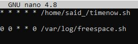
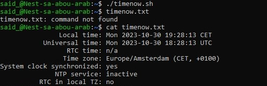
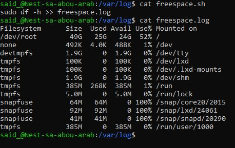

# Cron Jobs
Cron Jobs zijn scripts die je regelmatig kan laten uitvoeren door te automatiseren.

## Key-terms
timedatectl = huidige tijd en datum

df -h = schijfdata

sudo mv = Verplaats bestand naar andere directory

crontab -e = Crontab editor.

## Opdracht
### Gebruikte bronnen
* cron schedule editor (https://crontab.guru/)
* adding .sh to crontab (https://www.baeldung.com/linux/create-crontab-script)
* check disk space (https://askubuntu.com/questions/73160/how-do-i-find-the-amount-of-free-space-on-my-hard-drive)
* current date/time (https://www.cyberciti.biz/faq/linux-display-date-and-time/)
* set timezone (https://askubuntu.com/questions/679988/how-to-change-ubuntus-server-date-and-time-via-command-line)
### Ervaren problemen

### Resultaat

* __Cronjobs; Time/Date and Available disk space__

 

* __Script with current time and date__

* __Available disk space__

