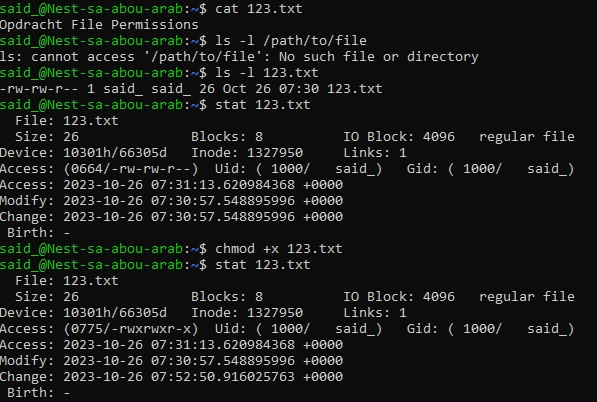
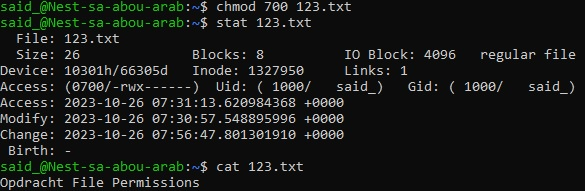
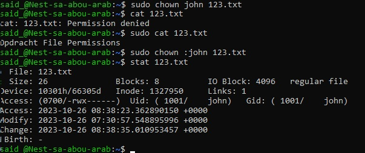

# File Permissions
Via de VM heb ik een bestand aangemaakt en gekeken wie de owner is en wat de permissions zijn. Het bestand executable gemaakt. Daarna de read en write permissions verwijderd voor group en others, maar niet voor owner. Andere user owner gemaakt. Ik kon bestand niet meer lezen, tenzij ik sudo gebruikte. Als laatst Group ownership veranandert.

## Key-terms
sudo cat bestandnaam = permissie tot alle bestanden te krijgen met root

sudo chown :groepsnaam bestandnaam = verandert group owner van bestand

sudo chown username bestandnaam = verander naar andere owner

chmod = om file permissions mee te veranderen

ls -l = permissies zien, korte versie

cat > maak bestand aan

cat bekijk bestand

stat +bestandnaam = om alle permission te zien, lange versie

chmod 700 = om permissies te verwijderen behalve owner

chmod +x bestandnaam = maakt bestand executable
## Opdracht
### Gebruikte bronnen
* Toon Permissies, owner, groups: (https://askubuntu.com/questions/175054/how-to-find-owner-and-group-of-a-directory)
* Uitleg read, write, execute rwx (https://askubuntu.com/questions/528411/how-do-you-view-file-permissions)
* Maak executable: (https://askubuntu.com/questions/229589/how-to-make-a-file-e-g-a-sh-script-executable-so-it-can-be-run-from-a-termi)
* Alleen rwx for owner: (https://askubuntu.com/questions/1129479/removing-read-access-from-a-file)
* Wijzig owner en group (https://learnubuntu.com/change-file-ownership/)

### Ervaren problemen
-

### Resultaat

