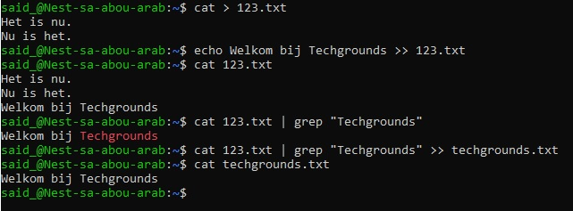

# Working with Text (CLI)
Met terminal in de VM nieuw tekstbestand aangemaakt met 2 zinnen. Met ''echo''+tekst input en als output op de terminal te zien. Tekst toegevoegd aan bestaand tekstbestand met ">>". Daarna woord ''techgrounds'' gefilterd met grep. Daarna hetzelfde maar nu met ''>>" toegevoegd aan nieuw tekstbestand.
## Key-terms
Echo = input tekst naar output terminal

.>> = toevoegen aan bestaande txt bestand

| grep ''woord'' 

.> nieuwe tekst of overschrijving

## Opdracht
### Gebruikte bronnen
* Zin selecteren met bepaald woord (https://stackoverflow.com/questions/4712521/filtering-linux-command-output)
* Zin toevoegen aan bestaande map, en in nieuwe map voegen (https://www.codecademy.com/learn/learn-the-command-line/modules/learn-the-command-line-redirection/cheatsheet)

### Ervaren problemen
Wist eerst niet hoe ik enkel de zin kon selecteren waar ''techgrounds'' instond. Via online bron gevonden. Zo ook de oplossing om deze zin in een aparte map te plaatsen.

### Resultaat
