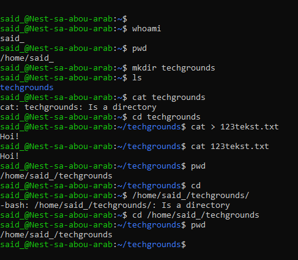

# Files and Directories
Verbinding gemaakt met de VM. Huidige cwd achterhaald. Overzicht opgehaald van alle bestanden en directories door gebruik van ls en ll. Nieuwe directory aangemaakt 'techgrounds'. Tekstbestand daarin gemaakt. Daarna absolute en relative paths rondgegaan door met cd volledige path uit te typen voor absolute of 'cd techgrounds' voor relative.
## Key-terms
mkdir = new directory 

cat > = new file, save with ctrl+d

cat = go to file

pwd = present working directory

cd = home, or go to directory when adding directory name

## Opdracht

### Gebruikte bronnen
* New directory (https://www.redhat.com/sysadmin/create-delete-files-directories-linux)
* File listing and pwd commands(https://www.geeksforgeeks.org/linux-commands-cheat-sheet/)
* Create txt file (https://unstop.com/blog/how-to-create-a-file-in-linux)
* Absolute and Relative Paths (https://vedslinux.blogspot.com/2013/10/absolute-path-vs-relative-path-in-linux.html)

### Ervaren problemen
Moeite met achterhalen hoe absolute en relative paths werkte. Uiteindelijk met online bronnen en hulp van medestudent wel gelukt.

### Resultaat

