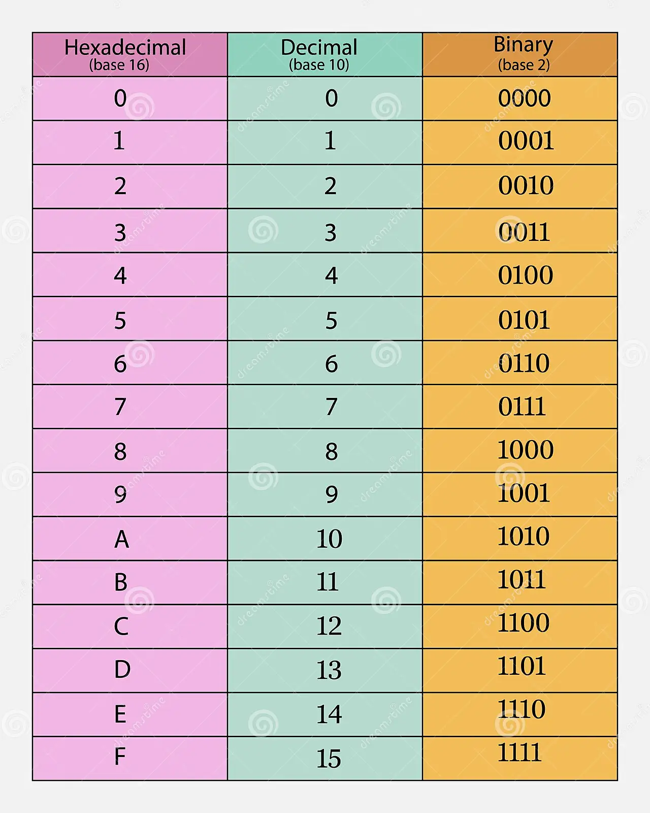

# Counting in binary and hex

    Decimaal 	    0 	1 	2 	3 	4 	5 	6 	7 	8 	9 	10 	11 	12 	13 	14 	15
    Hexadecimaal 	0 	1 	2 	3 	4 	5 	6 	7 	8 	9 	A 	B 	C 	D 	E 	F
    Binair 	        0000 	0001 	0010 	0011 	0100 	0101 	0110 	0111 	1000 	1001 	1010 	1011 	1100 	1101 	1110 	1111

* _Decimal to Binary__

Het omrekenen van een decimaal getal naar een binair getal kan worden gedaan door herhaaldelijk te delen door 2 en de restwaarden op te schrijven. Hier is een stapsgewijze uitleg:

Laten we als voorbeeld het decimale getal 23 omzetten naar binair.

    Begin met het getal waarvan je de binaire equivalent wilt vinden, in dit geval 23.

    Deel het getal door 2 en schrijf zowel de quotient (het resultaat van de deling) als de rest (de rest na deling) op:
        23 gedeeld door 2 geeft een quotient van 11 en een rest van 1. Dus schrijf "1" op.

    Neem het quotient uit stap 2 en herhaal de deling door 2:
        11 gedeeld door 2 geeft een quotient van 5 en een rest van 1. Schrijf "1" op naast het eerdere "1".

    Herhaal dit proces totdat het quotient in de deling 0 is:
        5 gedeeld door 2 geeft een quotient van 2 en een rest van 1. Schrijf "1" op naast de eerdere "11".
        2 gedeeld door 2 geeft een quotient van 1 en een rest van 0. Schrijf "0" op naast de eerdere "111".
        1 gedeeld door 2 geeft een quotient van 0 en een rest van 1. Schrijf "1" op naast de eerdere "1110".

    Stop wanneer het quotient in de deling 0 is.

    Schrijf de binaire getallen op die je in elke stap hebt genoteerd van rechts naar links. 
    Het resultaat is het binaire equivalent van het oorspronkelijke decimale getal. In ons voorbeeld is het binaire equivalent van 23: 10111.

* __Voorbeeld__

16/2 = 8 = 0 

8/2 = 4 = 0

4/2 = 2 = 0

2/2 = 1 = 0

1/2 = 0,5 = 1

Dit lees je van onder-naar-boven: 10000. De hoeveelheid cijfers wordt bepaald door de hoeveelheid delingen. In dit voorbeeld is dat 5 keer gebeurt en krijg je dus 5 cijfers.

    | Decimal | Binary   |
    |---------|----------|
    | 16      | 10000    |
    | 128     | 10000000 |
    | 228     | 11100100 |
    | 112     | 1110000  |
    | 73      | 1001001  |

---

* __Binary to Decimal__

Om binar naar decimaal om te rekenen vermenigvuldig je van rechts naar links bij de binare reeks. Hierbij bepaalt de hoeveel binaire cijfers hoevaak je vermenigvuldig. 
Hier gebruik je het schema; 1, 2, 4, 8, 16, 32, 64, 128, 256. Begin bij 1 als eerst waarde.

Om van een binair getal naar een decimaal getal te converteren, kun je de volgende stappen volgen:

    Begin met het meest rechtse cijfer (de minst significante bit) in het binaire getal.

    Ken een waarde toe aan dat cijfer, beginnend met 1 en verdubbel deze waarde voor elk cijfer naar links.

    Vermenigvuldig elk cijfer in het binaire getal met de overeenkomstige waarde uit stap 2.

    Tel alle waarden op die je hebt berekend in stap 3 om het decimale equivalent te krijgen.

Hier is een stapsgewijs voorbeeld:

Laten we het binaire getal 10111 omzetten naar decimaal.

    Begin met het meest rechtse cijfer, dat is 1.

    Ken een waarde toe aan 1, beginnend met 1 en verdubbel deze waarde voor elk cijfer naar links:
        Het meest rechtse cijfer krijgt de waarde 1.
        Het volgende cijfer naar links krijgt de waarde 2.
        Het volgende cijfer krijgt de waarde 4.
        Het volgende cijfer krijgt de waarde 8.
        Het meest linkse cijfer krijgt de waarde 16.

    Vermenigvuldig elk cijfer in het binaire getal met de overeenkomstige waarde:
        1 * 1 = 1
        1 * 2 = 2
        1 * 4 = 4
        0 * 8 = 0
        1 * 16 = 16

    Tel alle waarden op die je hebt berekend in stap 3:
    1 + 0 + 4 + 8 + 16 = 29

Dus, het binaire getal 10111 is gelijk aan het decimale getal 29. Dit is het decimale equivalent van het gegeven binair getal. Je kunt dezelfde methode gebruiken om andere binair getallen naar decimaal te converteren.

* __Voorbeeld__

0x1 = 0

1x2 = 2

0x4 = 0

1x8 = 8

0x16 = 0

1x32 = 32

0x64 = 0 

1x128 = 128

Nu trek je alles bij elkaar op: 2+8+32+128 = 170

    | Binary    | Decimal |
    |-----------|---------|
    | 1010 1010 | 170     |
    | 1111 0000 | 240     |
    | 1101 1011 | 219     |
    | 1010 0000 | 160     |
    | 0011 1010 | 58      |

---

* __Decimal to Hexademical__

      Deel / het decimaal getal door 16 en schrijf het gehele getal (integer) op, en bewaar de rest achter de komma. Doe dan 16 * rest en schrijf het resultaat op als Remainder.

      Herhaal dit totdat je een 0 heb vóór de komma en doe 16* Rest. Vertaal dan de restcijfers naar de hexadecimale karakters.

      Hexadecimaal heeft 10 cijfers, van 0 t/m 9, en 5 letters, van A t/m F. (base 16). A t/m F is dus gelijk aan 10 t/m 15 in decimale getallen.

      Het eerste restgetal is het minst significant (LSD), en het laatste restgetal het meest significant (MSD). Het resultaat schrijf je dus op van laatste naar eerste.

* __Voorbeeld__

41203/16 = 2.575,1875 = I-2575  16×0,1875 = R-3
2575/16 = 160,9375 = I-160 16*0,9375 = R-15
160/16 = 10 = I-10 = R 0
10/16 = 0,625 = I-0 16*0,625 = R-10

Remainder van onder naar boven: 10, 0, 15, 3. 10=A, 0=0, 15=F, 3=3. Hexadecimaal: a0f3

    | Decimal | Hexadecimal |
    |---------|-------------|
    | 15      | F           |
    | 37      | 25          |
    | 246     | F6          |
    | 125     | 7D          |
    | 209     | D1          |

---

* __Hexademical to Decimal__

Een hexadecimaal getal naar een decimaal getal om te rekenen doe je zo:

    Schrijf het hexadecimale getal op.
    Wijs aan elk cijfer van rechts naar links een waarde toe, beginnend bij 0 en oplopend met 15.
    Vermenigvuldig elk cijfer met 16 tot de macht van zijn positie en tel de resultaten op.

    Decimale waardes bij de hexadecimale waardes:
    Decimaal 	    0 	1 	2 	3 	4 	5 	6 	7 	8 	9 	10 	11 	12 	13 	14 	15
    Hexadecimaal 	0 	1 	2 	3 	4 	5 	6 	7 	8 	9 	A 	B 	C 	D 	E 	F

Laten we bijvoorbeeld het hexadecimale getal “3A” omrekenen naar decimaal:

    3A = (3 * 16^1) + (10 * 16^0)
    = (3 * 16) + (10 * 1)
    = 48 + 10
    = 58

Dus het hexadecimale getal 3A komt overeen met het decimale getal 58.

    8*16^1 + 8*16^0 = 136

    8x16^1 = 128 
    8^16^0 = 8
    128+8 = 136

    | Hexadecimal | Decimal |
    |-------------|---------|
    | 88          | 136     |
    | e0          | 224     |
    | cb          | 203     |
    | 2f          | 47      |
    | d8          | 216     |

---

## Key-terms
* Binair talstelsel heeft 2 cijfers, 0 en 1. (base2)
* Decimaal heeft 10 cijfers, van 0 t/m 9. (base 10)
* Hexadecimaal heeft 10 cijfers, van 0 t/m 9, en 5 letters, van A t/m F. (base 16)

## Opdracht
### Gebruikte bronnen
* Decimal to Binary (https://www.cuemath.com/numbers/decimal-to-binary/)
* Binary to Decimal (https://www.cuemath.com/numbers/binary-to-decimal/)
* Hexadecimal to Decimal and vice versa (https://geocachen.nl/geocaching/geocache-puzzels-oplossen/hexadecimale-getallen/)

#

* __Conversion Table__

