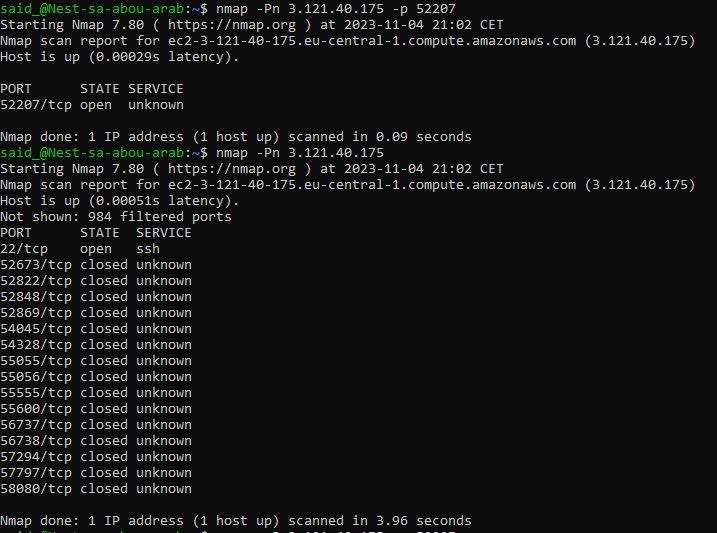

# Network detection 
Network scans uitgevoerd met nmap en Wireshark. Mijn Port is open.

## Key-terms
sudo apt-get install nmap = installeer nmap in VM 

## Opdracht
### Gebruikte bronnen
* Install nmap on Ubuntu (https://linuxhint.com/use-nmap-command-ubuntu/)
* Nmap cheatsheet (https://www.stationx.net/nmap-cheat-sheet/)

### Resultaat

