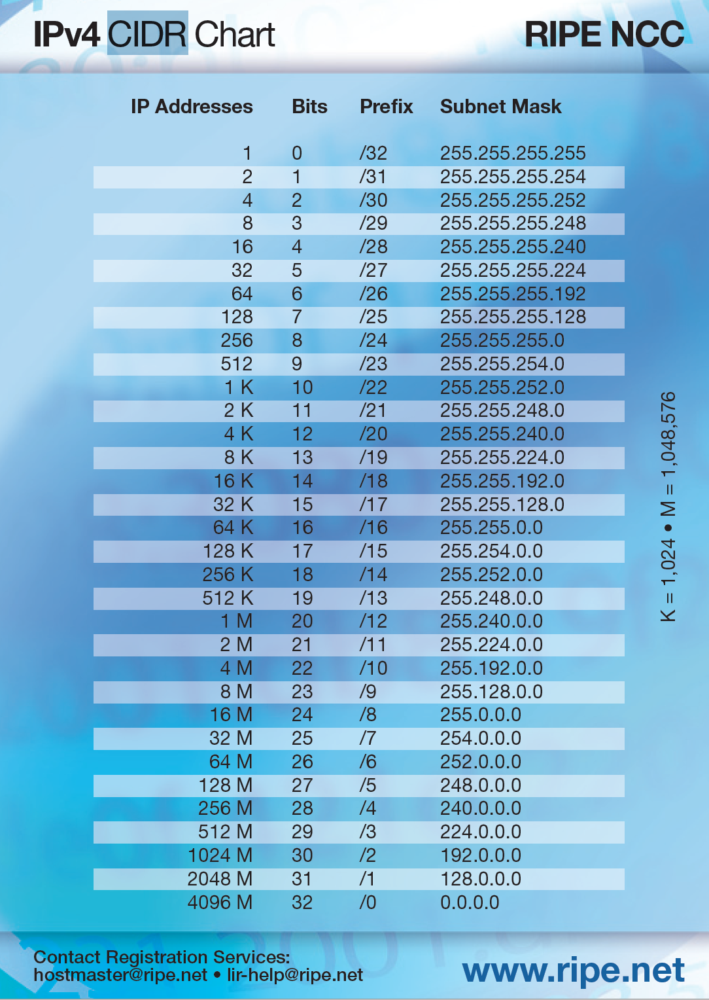
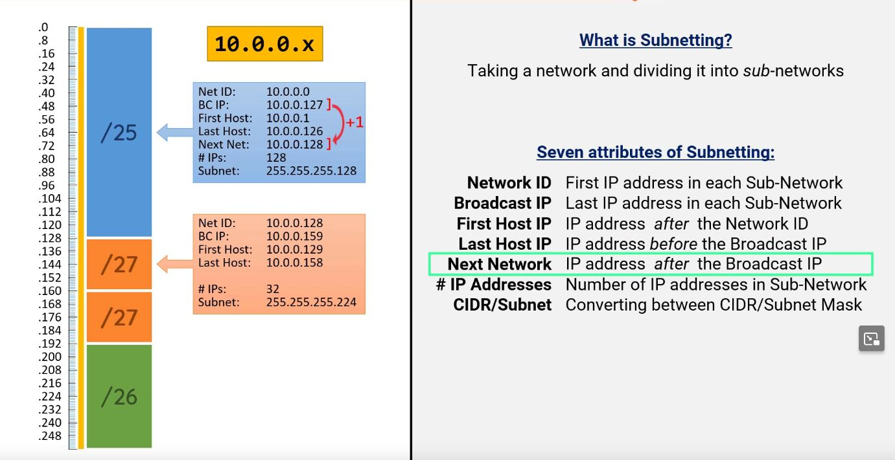
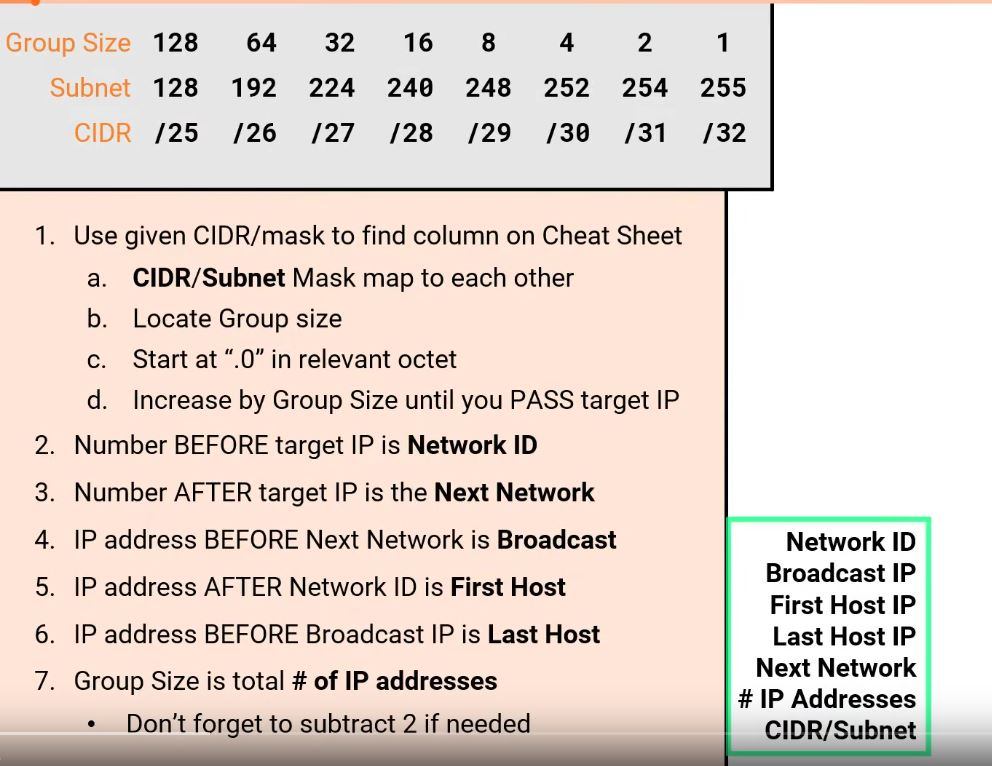

# Subnetting
Een subnet is een kleiner netwerk dat onderdeel is van een groter netwerk. Subnets kunnen worden gebruikt om een deel van het netwerk logisch te isoleren. Een subnet heeft per definitie een grotere prefix dan het netwerk waar het subnet in zit.

Het gehele netwerk heeft IP-adressen van .0 t/m .255. Dat heet een 24/ network. 
Dat is in 2 te delen als /25 dat loopt van .0 t/m .127 en van .128 t/m .255.
Of als 4 delen /26 dat loopt van .0 t/m .63, .64 t/m .127, .128 t/m .191, .192 t/m .255 etc.

Het eerste (network IP) en laatste (broadcast IP) mogen niet worden uitgegeven aan users.
Van de totaal aantal IPs per /blok, die per groep verschillen, zijn er altijd 2 minder beschikbaar. Die 2 zijn gereserveerd voor network en broadcast ip.
Een IPv4 adres heeft 32 bits (4 bytes). 1 byte bestaat ook 8 bits.
Een IPv4 adres heeft 32 bits (4 bytes), en is meestal geschreven in decimalen (bijvoorbeeld: 132.88.142.5) waar iedere blok voor, na, en tussen de punten, 1 byte is. Dit betekent dat één blok tussen punten een maximale waarde kan hebben van 255. 2 tot de 8ste macht.
Er zijn 3 IP adres bereiken gereserveerd voor privé netwerken. Iedereen gebruikt één van deze netwerken thuis of op werk. Deze zijn:
192.168.0.0 - 192.168.255.255
172.16.0.0 - 172.31.255.255
10.0.0.0 - 10.255.255.255

Subnetting betekent één netwerk nemen en het opdelen in kleinere netwerken.

* __7 Attributes of Subnetting__

Network ID: 

Broadcast IP: 

First Host IP: 

Last Host IP:

 Next Network: 

#IP Addresses: 

CIDR/Subnet: 

* __Netwerkarchitectuur__

Ik heb gekozen voor...

## Opdracht
### Gebruikte bronnen
* What is Subnetting (https://www.youtube.com/watch?v=BWZ-MHIhqjM&ab_channel=PracticalNetworking)
* Cheatsheet (https://www.youtube.com/watch?v=ljS07YTEJ2I&ab_channel=PracticalNetworking)
* Using Cheatsheet (https://www.youtube.com/watch?v=5-wlfAdcmFQ&ab_channel=PracticalNetworking)

### Resultaat

* __CIDR Chart__

* __7 Attributes of Subnetting__

* __Cheatsheet and Protocol__

