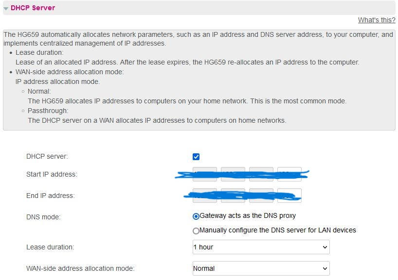
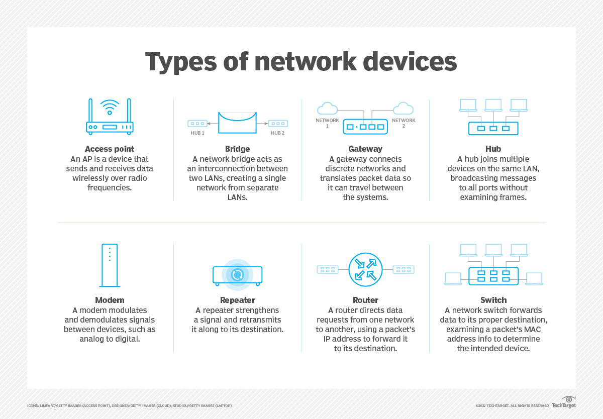

# Networking Devices
Ingelezen over netwerkapparatuur en de verhouding met het OSI Model. Ingelogd op mijn router om te zien welke apparaten zijn aangesloten. De aanvullende informatie over deze apparaten gezien en de configuratie van de DHCP server.

## Key-terms
Host = elk toestel dat verkeer verzendt of ontvangt.

Client = Verzoek sturen. Server = Verzoek beantwoorden.

Servers = Computers met software die op verzoeken reageert.

IP = Identeit van elke host. Stuurt een verzoek met daarin Source, eigen IP, en Destination IP, die van de website of server. Omgekeerd stuurt de server de eigen source ip en de destination ip.

Network = Vervoert het verkeer tussen hosts.

Switch = Faciliteert communicatie binnen één netwerk

Repeater = Versterkt signaal.

Router = Faciliteert communicatie tussen verschillende netwerken, zoals lokale netwerken (LAN) en het internet. Ze bepalen de optimale route voor gegevenspakketten om van de bron naar de bestemming te gaan.

DHCP = Dynamic Host Configuration Protocol. Het is een netwerkprotocol dat wordt gebruikt om automatisch IP-adressen en andere netwerkconfiguratie-informatie toe te wijzen aan apparaten die zijn aangesloten op een TCP/IP-netwerk. DHCP vereenvoudigt het proces van het handmatig configureren van IP-adressen op elk apparaat in een netwerk, wat vooral handig is in grotere netwerkomgevingen.

Netwerkapparatuur = Netwerkapparatuur verwijst naar fysieke apparaten die worden gebruikt om computer- en communicatienetwerken te bouwen, te beheren en te onderhouden. Deze apparatuur speelt een cruciale rol bij het faciliteren van gegevens- en communicatiestromen in zowel lokale netwerken (LAN) als grotere wide area networks (WAN).

## Opdracht
### Gebruikte bronnen
* Inloggen router (https://community.odido.nl/bekabeld-internet-492/inloggen-in-het-modem-298043)
* DHCP vinden (https://serverfault.com/questions/293556/how-do-i-determine-what-my-dhcp-server-is)
* 8 Netwerkapparaten (https://www.techtarget.com/searchnetworking/tip/An-introduction-to-8-types-of-network-devices)

### Ervaren problemen

### Resultaat
* Ingelogd met adres van router (192.168.1.1) in browser; 2 apparaten aangesloten. Mijn PC en smartphone

* Aanvullende informatie over aangesloten apparaten: MAC addrers, IP Address, IPv4 Addressing Type: DHCP, Lease Type.

__DHCP vind je via het routeradres (192.168.1.1). Bij LAN Interface;__

__Network Devices__

__OSI model en Network Devices__
