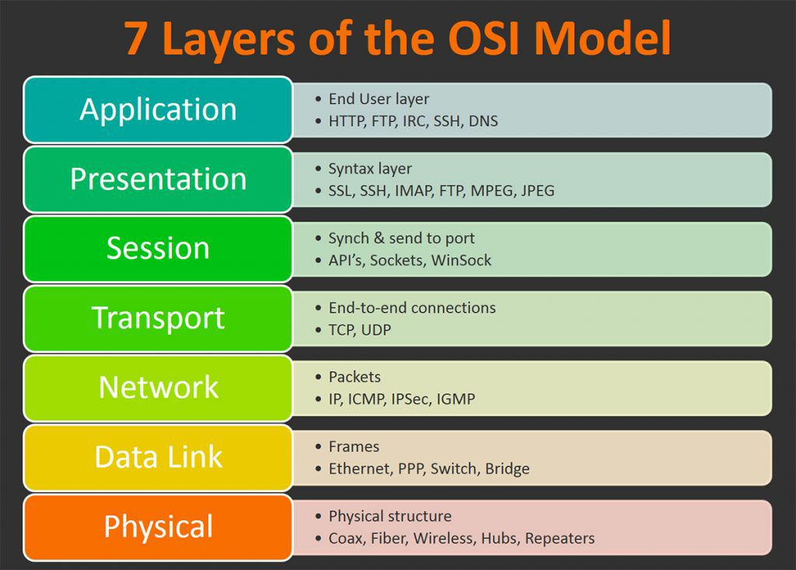

# OSI Stack
Heb mij ingelezen over OSI en TCP/IP. OSI model wordt niet gebruikt, maar is handig als troubleshooter. TCP/IP is de standaard die daadwerkelijk wordt gebruikt door het internet.

## Key-terms
OSI is een theorische stack van 7 lagen om te begrijpen hoe een netwerk functioneert. All People Seem To Need Data Processing.

Laag 1 Physical Layer is de onderste. Die draagt de data middels fysieke hardware, zoals internetkabels, NIC, Hubs.

Laag 2 DataLink Layer. De fysiek adressen worden van laag 1 toegevoegd aan de data. Zoals de source en destination MAC addresses. En de switch.

Laag 3 Network Layer. de source en destination ip adres worden toegevoegd. De router werkt op deze layer.

Laag 4 Transport Layer. TCP, gebruikt error handling en sequencing, op orde brengen, zodat geen data verloren gaat. Source en Destination port numbers.

Laag 5 Session Layer. Oprichten en stoppen van verbindingen tussen devices.

Laag 6 Presentation Layer. Formatteert data zodat de ontvangende app het kan begrijpen. Kan ook versleutelen en ontsleutelen.

Laag 7 Application Layer. De bovenste laag. User gebruikt bijv. browser om met applicatie te communiceren.

Bij het verzenden van dat begin het bij Layer 7 en loopt af tot en met Layer 1, bij het ontvangen loopt het van Layer 1 naar boven tot en met Layer 7.

IP is het adressyteem van het internet en zorgt voor de levering van packets informatie van de source device naar het target device. IP is de voornaamste manier om netwerkverbindingen te maken en vormt de basis van het internet. 
## Opdracht
### Gebruikte bronnen
* OSI 7-layers (https://www.bmc.com/blogs/osi-model-7-layers/)
* OSI Model (https://www.cloudflare.com/learning/ddos/glossary/open-systems-interconnection-model-osi/)
* TCP/IP (https://www.cloudflare.com/learning/ddos/glossary/tcp-ip/)
* TCP/IP 2 (https://www.fortinet.com/resources/cyberglossary/tcp-ip)
* TCP/IP 3 (https://www.guru99.com/tcp-ip-model.html)

### Ervaren problemen

### Resultaat
__TCP/IP Model en wat het doet__

TCP zorgt voor het samenstellen van de ontvangen packets en vraagt indien nodig aan de sender naar de ontbrekende packets. TCP behoudt ten alle tijden contact met de sender gedurende de overdracht.

__OSI Model 7-Layers en netwerkapparatuur__

__OSI Model 7-Layers en wat elke Layer doet__

__OSI en TCP/IP vergelijking__

