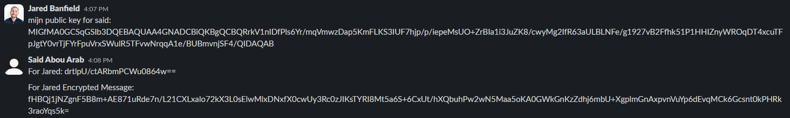
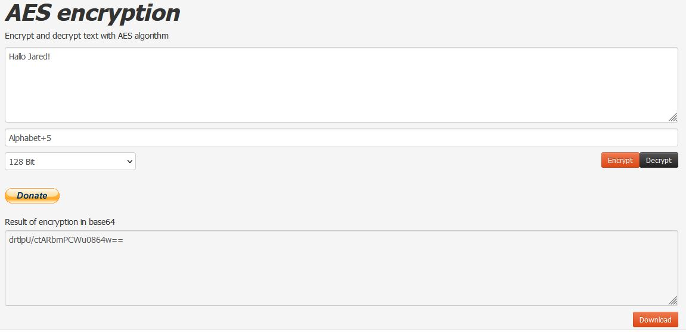
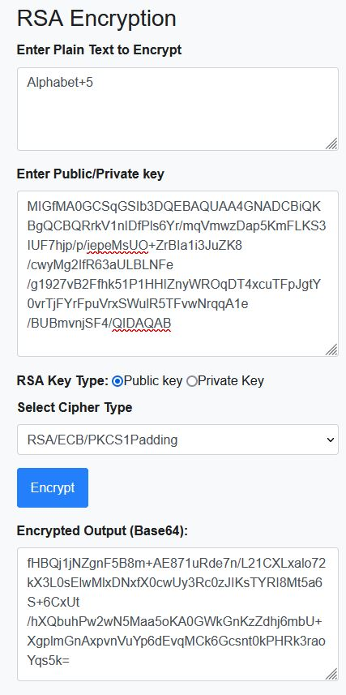
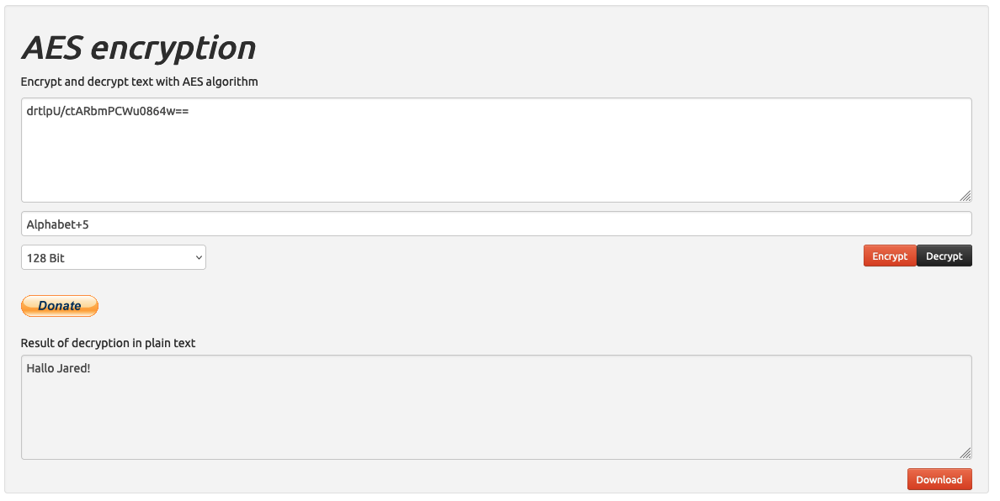
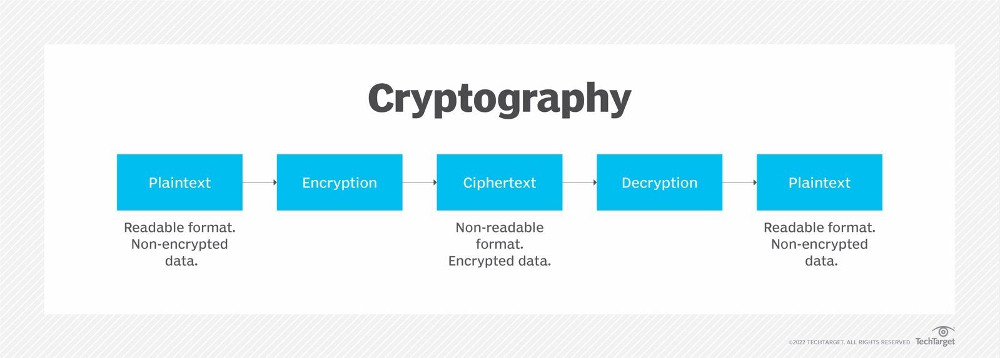

# Asymmetric and Symmetric Encryption
Encryption is the process of encoding information. This process converts the original representation of the information, known as plaintext, into an alternative form known as ciphertext. Ideally, only authorized parties can decipher a ciphertext back to plaintext and access the original information. Encryption does not itself prevent interference but denies the intelligible content to a would-be interceptor. 

Encryption is used to provide Confidentiality. Only the intented recipient can interpret the data. 

## Key-terms
* A cryptosystem is a suite of cryptographic algorithms needed to implement a particular security service, such as confidentiality.
* Public-key algorithms, or asymmetric cryptography.
* Single-key algorithms, or symmetric cryptography.
* In public key cryptography, each user has a pair of cryptographic keys:

        a public key
        a private key

* A cipher (or cypher) is an algorithm for performing encryption or decryption—a series of well-defined steps that can be followed as a procedure.
* 2048-bits is recommended for Encryption.   
* A Public and Private Key are generated at the same time as a Pair. 
    * Each key pair consists of a public key and a corresponding private key
* Secret/Private Key: Private Key opens messages that were encrypted with the Public Key that it's paired with. A Private Key can also be used to encrypt a message that can be opened with the Public Key.
* Public Key: Allows people to encypt messages. But only the one with Private Key that is paired to the Public Key can open it.

* Public key encryption: a message encrypted with a recipient's public key cannot be decrypted except by the recipient private key. This is used to ensure secrecy.
* Digital signatures: a message signed with a sender's private key can be verified by anyone who has the sender's public key. 
So if the sender signed the message no one can alter it. This is used to get authenticity.
* Plain/Clear Text: Data before encryption and after decryption.
* Cipher Text: Data while encrypted or after encryption.
* Simple Encryption: Transforms Plain Text into Cipher Text.
        
        * Doesn't scale.
        * Hard to do securely.
        * Cannot simply use Standard Algorithm that is known to the public. That makes it easy for everyone to decrypt.
* Key Based Encryption: Combines industry vetted algorithms with Secret Keys, which can be randomly generated.

---

* 2 Types of Key Based Encryption: 
    * Symmetric: Encrypts and Decrypts using the __same__ Key. It moves forwards to Encrypt and backwards to Decrypt. 
    
        Security is weak, secret key is shared, because when someone intercepts the key before it reaches the recipient they can decrypt the message. It's faster and has lower CPU usage. Better for Bulk Data.

            It uses a series of characters like the alphabet and moves forward to encrypt. An example would be a Secret Key that moves forward 3 times. The word Hello becomes Khoor. To decrypt you simply move backwards 3 times. Because it is the same Key it can only execute the same amount of steps.
       
    * Asymmetric: Encrypts and Decrypts using __different__ Keys. It moves forwards to Encrypt __and__ forwards to Decrypt. 
    
        More secure. But slower because it generates much larger Key sizes. Better for Limited Data.

            It uses a series of characters like the alphabet and moves forward to encrypt. 
            An example would be a Secret Key that moves forward 5 times. The word Hello becomes mjqqt.
            To decrypt you don't just move back 5 times. 
            But you use a different Key to also move forwards 21 times so it passes Z and A to finally reach the letter H. 
            It repeats this process with every encrypted letter.

* The 2 different Keys are related and the number of steps forward and backwards should add up to the total number of characters available in the character string used. In this case the alphabet has a total of 26 characters. So if you used 5 steps to move forward to Encrypt you have to move 21 steps forward to Decrypt so it will add up to 26.

* Because encrypting Bulk Data using Assymetric encryption is burdersome, it's better to use Symmetric encryption to encrypt it. But it has weak security, so a way around this is to use Assymetric to encrypt the Symmetric key and send it to the recipient.

* A Key is a code that could be anything.

* Sender: The one who sends the Encrypted message to you, using your Public Key.

* Recipient: The one who receives the Encrypted message that was Encrypted with their own Public Key. It can be Decrypted by using the Recipient's Private Key.

* Asymmetric encryption route:

        Generate a Public and Private Key pair. Send the Public Key to the person you want to receive the message from. 
        They will write a message and encrypt it using your own Public Key. 
        They will send the Encrypted message to you, that you can then Decrypt by using your own Private Key
        That is paired with the Public Key that was used to Encrypt it.

        You can also send a message yourself and encrypt it using your Private Key. 
        If you send the Encrypted message it can be opened by anyone who has the Public Key that is paired with your Private Key.

* Symmetric encryption route: 

        Write as message that you want to Encrypt. Make up your own Key. This could be anything like a word or a string of characters. 
        Press Encrypt and share the Encrypted message with the recipient. To Decrypt it they need the Key. 
        This can't be shared publicly because then everyone can Decrypt the message. 

* Hybrid Encryption: uses both Symmetric and Asymmetric encryption. 

        You can encrypt the Bulk Data using Symetric because it's faster and uses less resources. 
        But to share the Key you can send it in a message and use Assymetric encryption to Encrypt it. 
        You will need the Public Key of the intended recipient to Encrypt the message that contains the Key. 
        The recipient can then decrypt it using their Private Key.
        
---

* Assymetric Key Pair can be used as Encryption and Signatures to provide:

        Confidentiality: Only the intended recipient with the Private Key can read and decrypt the message.
    
        Authentication: if the recipient can open the message using the Public Key of the sender, 
        it means it was encrypted with the sender's Private Key. 

        Integrity: if the recipient can't open the message with the sender's Public Key, 
        it might be because the encrypted message was modified during transit. 
        The edited encrypted message is not matched to a pair of Keys.

---

* __Examples of Historial Ciphers__

        __Caesar:__ This cipher is attributed to Julius Caesar, who is said to have used it to communicate securely with his generals. It is a simple substitution cipher where each letter in the plaintext is shifted a specific number of places down the alphabet. The shift number said to be used by Caesar was three. Substitution ciphers are often implemented by writing down the plaintext alphabet, with the ciphertext alphabet written above the plaintext letters, shifted by the number those communicating agree to. A shift of three puts the letter D above the plaintext A, E above B and so on. The number of characters shifted is considered a simple form of a key.

        __Atbash:__ This cipher is a substitution cipher in which the plaintext alphabet is mapped onto itself but in reverse order. In other words, the plaintext letter A is mapped to ciphertext Z, B is mapped to Y, C to X and so on. Atbash is named after the two first and two last letters in the Hebrew alphabet. It is thought to have been in use for hundreds of years.

* __Examples of Digital Ciphers__

        __Advanced Encryption Standard (AES):__ This is a Symmetric encryption that uses the same key to encrypt and decrypt protected data. 
        Instead of a single round of encryption, data is put through several rounds of substitution, transposition, and mixing to make it harder to compromise.

        __RSA:__: This is a type of Asymmetric encryption, which uses two different but linked keys. 
        In RSA cryptography, both the public and the private keys can encrypt a message. The opposite key from the one used to encrypt a message is used to decrypt it.

## Opdracht
### Gebruikte bronnen
* __Symmetric and Asymmetric Encryption__ (https://www.youtube.com/watch?v=o_g-M7UBqI8&ab_channel=PracticalNetworking)
* __Public and Private Keys__ (https://www.youtube.com/watch?v=_zyKvPvh808&ab_channel=PracticalNetworking)
* __Types of Ciphers__ (https://www.techtarget.com/searchsecurity/definition/cipher)
* __AES Encryption/Symmetric Tool__ (https://aesencryption.net/)
* __RSA Encryption/Asymmetric Tool__ (https://www.devglan.com/online-tools/rsa-encryption-decryption)

### Resultaat

* __Slack Public Key and Encrypted Message in AES and Encrypted Message in RSA that contains Key to AES message__

* __Encrypting Key for Jared in AES__

* __Encrypting AES Key in RSA for Jared using his Public Key__

* __Jared Decrypted the message in AES__

* __Encryption/Decryption Route__

