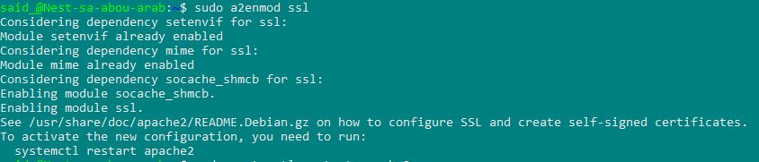
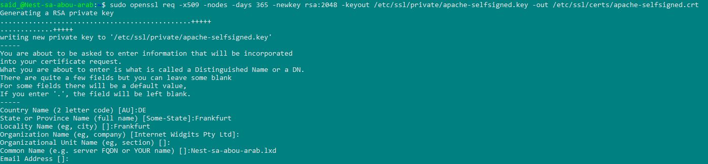
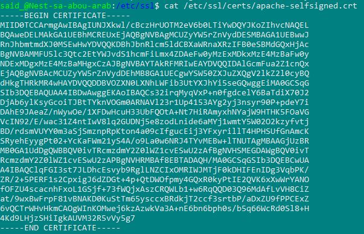
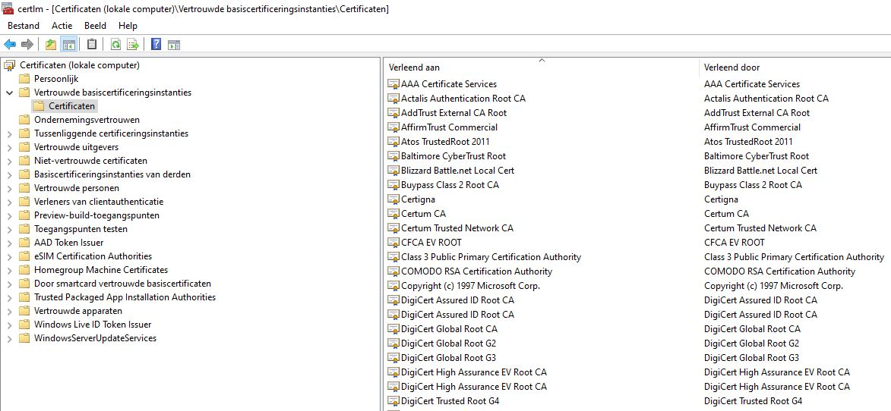
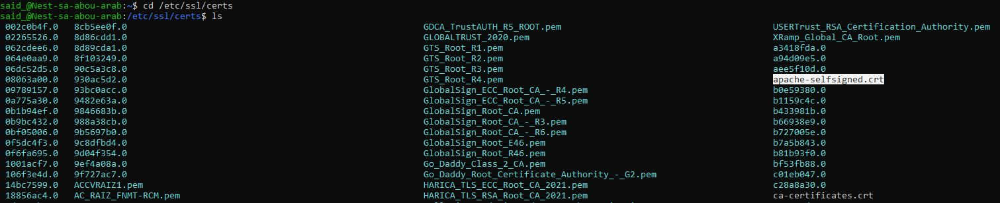

# Public Key Infrastructure

A public key infrastructure (PKI) is a set of roles, policies, hardware, software and procedures needed to create, manage, distribute, use, store and revoke digital certificates and manage public-key encryption. The purpose of a PKI is to facilitate the secure electronic transfer of information for a range of network activities such as e-commerce, internet banking and confidential email. It is required for activities where simple passwords are an inadequate authentication method and more rigorous proof is required to confirm the identity of the parties involved in the communication and to validate the information being transferred. 

In cryptography, a PKI is an arrangement that binds public keys with respective identities of entities (like people and organizations). The binding is established through a process of registration and issuance of certificates at and by a certificate authority (CA). Depending on the assurance level of the binding, this may be carried out by an automated process or under human supervision. When done over a network, this requires using a secure certificate enrollment or certificate management protocol.

## Key-terms

The SSL/TLS internet security standard is based on a trust relationship model, also called “certificate chain of trust.” x.509 digital certificates validate the identity of a website, organization, or server and provide a trusty platform for the user to connect and share information securely.

3 Entities form a PKI:

Client - needs to connect securely or verify an identity.  
Server - needs to prove its identity.  
Certificate Authority - validate identities and generates certificates.

An X.509 certificate is a digital certificate based on the widely accepted International Telecommunications Union (ITU) X.509 standard, which defines the format of public key infrastructure (PKI) certificates. They are used to manage identity and security in internet communications and computer networking.

## Opdracht
### Gebruikte bronnen
* __Create Self-Signed Certificate__ (https://www.digitalocean.com/community/tutorials/how-to-create-a-self-signed-ssl-certificate-for-apache-in-ubuntu-22-04)
* __What is PKI__ (https://www.youtube.com/watch?v=Jefr7wFLu3M&ab_channel=PracticalNetworking)

### Resultaat

* __Enable SSL__

* __Create SSL Certificate__

* __Readable Certificate__

* __Trusted Certificates on My PC__

* __Partial Certificates List on VM__

