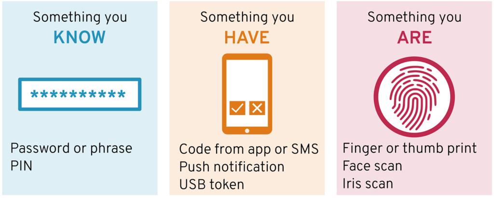

# Identity and Access Management

Identity and access management provides control over user validation and resource access. 

Commonly known as IAM, this technology ensures that the right people access the right digital resources at the right time and for the right reasons.

## Key-terms

* Authentication verifies who the user is.

* Authorization determines what resources a user can access.

* 2F and 3F = Uses either 2 or 3 Factors to Authenticate users.

* The three authentication factors are:

        Knowledge Factor – something you know, e.g., password
        Possession Factor – something you have, e.g., mobile phone
        Inherence Factor – something you are, e.g., fingerprint

* Multi-factor authentication (MFA): is a multi-step account login process that requires users to enter more information than just a password. For example, along with the password, users might be asked to enter a code sent to their email, answer a secret question, or scan a fingerprint.

* What you know: Most commonly, this is a password. But it can also be an answer to a security question or a one-time pin that grants user access to just one session or transaction. 

* What you possess: This could be a mobile device or app, a security token, or digital ID card.

* What you are: This is biometric data such as a fingerprint, retinal scan, or facial recognition.

* The principle of least privilege (PoLP) is an information security concept which maintains that a user or entity should only have access to the specific data, resources and applications needed to complete a required task. Organizations that follow the principle of least privilege can improve their security posture by significantly reducing their attack surface and risk of malware spread.

## Opdracht
### Gebruikte bronnen
* __IAM__ (https://www.onelogin.com/learn/iam)
* __Authentications and Authorization__ (https://www.sailpoint.com/identity-library/difference-between-authentication-and-authorization/)
* __Authentication Methods__ (https://www.sailpoint.com/identity-library/authentication-methods-used-for-network-security/)
* __3 Authentication Factors__ (https://rublon.com/blog/what-are-the-three-authentication-factors/)
* __PoLP__ (https://www.cyberark.com/what-is/least-privilege/)

### Graphic MFA
