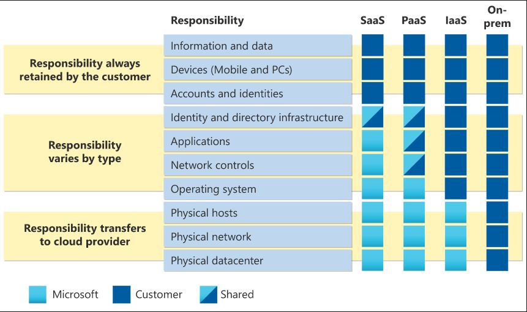

# Azure Core Services

## Key-terms

    Regions and Region Pairs:
        Azure is organized into geographic regions around the world. Each region contains one or more data centers. Region pairs are regions within the same geography that are designed to provide data residency and business continuity.

    Availability Zones:
        Availability Zones are physically separate data centers within an Azure region. They are designed to ensure high availability by providing redundant power, cooling, and networking.

    Resource Groups:
        Resource Groups are logical containers for resources deployed in Azure. They help organize and manage resources as a single entity.

    Subscriptions:
        Subscriptions provide a way to organize and manage access to Azure resources. They can be associated with billing and are used to manage resource usage.

    Management Groups:
        Management Groups are containers for organizing and applying governance controls on multiple subscriptions. They help manage policies, access, and compliance across an organization.

    Azure Resource Manager:
        Azure Resource Manager (ARM) is the deployment and management service for Azure. It enables you to define, deploy, and manage resources in a consistent manner.

    Virtual Machines:
        Virtual Machines (VMs) are scalable computing resources in Azure. They allow you to run Windows or Linux-based applications.

    Azure App Services:
        Azure App Services is a fully managed platform for building, deploying, and scaling web apps. It supports various languages and frameworks.

    Azure Container Instances (ACI):
        ACI enables you to run containers without managing the underlying infrastructure. It provides a fast and scalable solution for containerized applications.

    Azure Kubernetes Service (AKS):
        AKS is a managed Kubernetes service that simplifies deploying, managing, and scaling containerized applications using Kubernetes.

    Azure Virtual Desktop:
        Azure Virtual Desktop is a desktop and app virtualization service that runs on Azure. It allows users to access their desktops and applications from any device.

    Virtual Networks:
        Virtual Networks allow you to create isolated and securely connected networks in Azure.

    VPN Gateway:
        VPN Gateway provides secure connections between on-premises networks and Azure Virtual Networks.

    Virtual Network Peering:
        Virtual Network Peering allows the linking of virtual networks in Azure, enabling resources in different virtual networks to communicate.

    ExpressRoute:
        ExpressRoute provides dedicated, private connections between on-premises networks and Azure data centers.

    Container (Blob) Storage:
        Azure Blob Storage is a scalable object storage solution for the cloud. It is used to store and manage unstructured data.

    Disk Storage:
        Disk Storage provides scalable and high-performance block storage for Azure VMs.

    File Storage:
        Azure File Storage offers fully managed file shares in the cloud.

    Storage Tiers:
        Storage Tiers in Azure allow you to optimize costs by selecting the right combination of performance and price for your data.

    Cosmos DB:
        Azure Cosmos DB is a globally distributed, multi-model database service designed for highly responsive and scalable applications.

    Azure SQL Database:
        Azure SQL Database is a fully managed relational database service.

    Azure Database for MySQL and PostgreSQL:
        These services provide fully managed, scalable databases for MySQL and PostgreSQL.

    SQL Managed Instance:
        SQL Managed Instance is a fully managed SQL Server instance with high compatibility.

    Azure Marketplace:
        The Azure Marketplace is an online store for discovering and purchasing various applications and services that can be used on the Azure platform.

## Opdracht

### Gebruikte bronnen

* __Core Services__ (https://k21academy.com/microsoft-azure/microsoft-azure-core-services-for-beginners/)
* __Shared Responsibility__ (https://learn.microsoft.com/en-us/azure/security/fundamentals/shared-responsibility)

### Resultaat

* __Shared Responsibility__

