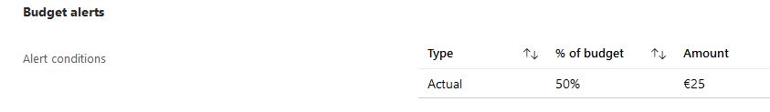
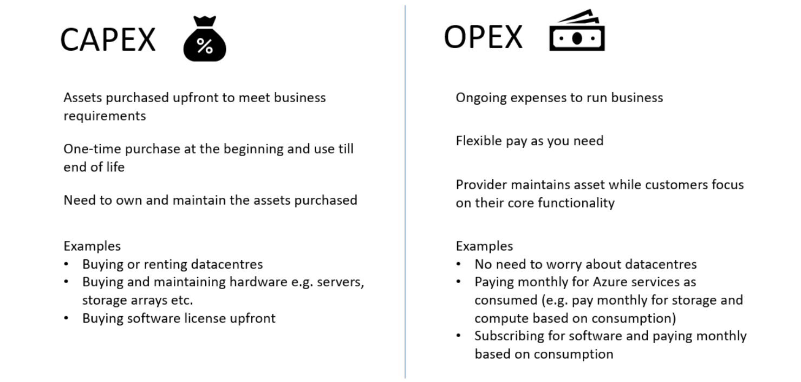

# Azure Cost Management

That OpEx cost can be impacted by many factors. Some of the impacting factors are:

    Resource type
    Consumption
    Maintenance
    Geography
    Subscription type
    Azure Marketplace

Cost Affecting Factors

    Base Cost
        Resource Types – All Azure services (resources) have resource-specific pricing models. Typically consisting of one or more metrics.
        Services – Azure specific offers (Enterprise, Web Direct, CSP, etc.) have different cost and billing components like prepaids, billing cycles, - discounts, etc.
        Location – running Azure services vary between Azure regions
        Bandwidth – network traffic when uploading (inbound/ingress) data to Azure or downloading (outbound/egress) from Azure

    Savings
        Reserved Instances
        Hybrid Benefits

Factors that can affect costs (resource types, services, locations, ingress and egress traffic)

Azure Cost Management

    A centralized service for reporting usage and billing of Azure environment
    Self-service cost exploration capabilities
    Budgets & alerts
    Cost recommendations
    Automated exports

Minimizing Costs in Azure

    Azure Pricing Calculator to choose the low-cost region
        Good latency
        All required services are available
        Data sovereignty/compliance requirements
    Hybrid use benefit and Azure Reservations
    Azure Cost Management monitoring, budgets, alerts and recommendations
    Understand service lifecycle and automate environments
    Use autoscaling features to your advantage
    Azure Monitor to find and scale down underutilized resources
    Use tags & policies for effective governance

Bestudeer:

    De Azure principes voor kostenmanagement
    De voorwaarden van de ‘Free subscription’
    Het verschil tussen CAPEX en OPEX.
    De TCO-calculator

Opdracht:

    Maak een alert aan waarmee je eigen kosten kan monitoren.
    Begrijp de opties die Azure aanbiedt om je uitgaven in te zien.

## Key-terms

Pricing Calculator: Azure Calculator is used to get pricing when you know exactly what you need in Azure, or want to look up pricing for the resources you know about.

Total Cost of Ownership: TCO Calculator is for when you want to estimate how much it would cost to move your resources from on-premises to Azure, by inputting what you are currently using, and letting it convert that into Azure equivalence. 

Free: This type of subscription is available for a limited period and provides a limited set of features and services at no cost.

Azure Reservations: Can be made for 1 or 3 years.

Capital Expenditure (CapEx)

    Upfront cost on physical infrastructure
    You need to plan your expenses at the start of a project or budget period.
    CapEx computing costs:

        Server costs – server clustering, redundant power supplies, and uninterruptible power supplies.

        Storage costs – centralized storage and fault-tolerant storage for critical applications.

        Network costs – cabling, switches, access points, routers, wide area networks, and Internet connections.

        Backup and archive costs – backup maintenance and consumables like tapes.

        Organization continuity and disaster recovery costs – recover from a disaster and continue operating using backup generators.
        Datacenter infrastructure costs – costs for construction and building equipment.

        Technical personnel – technical expertise and workforce to install, deploy, and manage the systems in the data center and at the DR site.

Operational Expenditure (OpEx)

    No upfront cost but you pay for the service/product as you use it
    OpEx is particularly appealing if the demand fluctuates or is unknown

    OpEX computing costs:

    Leasing software and customized features –  responsibility to de-provision the resources when they aren’t in use so that you can minimize costs.

    Scaling charges based on usage/demand instead of fixed hardware or capacity – plan for backup traffic and disaster recovery traffic to determine the bandwidth needed.

    Billing at the user or organization level – when using a dedicated cloud service, you could pay based on server hardware and usage.

## Opdracht

### Gebruikte bronnen

* __CapEx and OpEx__ (https://tutorialsdojo.com/azure-capex-vs-opex/)
* __Cost Management__ (https://marczak.io/az-900/episode-37/cheat-sheet/)
* __TCO and Azure Pricing__ (https://www.learnthecontent.com/exam/azure/az-900-microsoft-azure-fundamentals/s/compare-the-pricing-calculator-and-the-total-cost-of-ownership-tco-calculato)
* __Free Subscription__ (https://azure.microsoft.com/en-us/free/free-account-faq)

### Ervaren problemen
[Geef een korte beschrijving van de problemen waar je tegenaan bent gelopen met je gevonden oplossing.]

### Resultaat

* __Budget Alert__

 

* __CapEx and OpEx__

