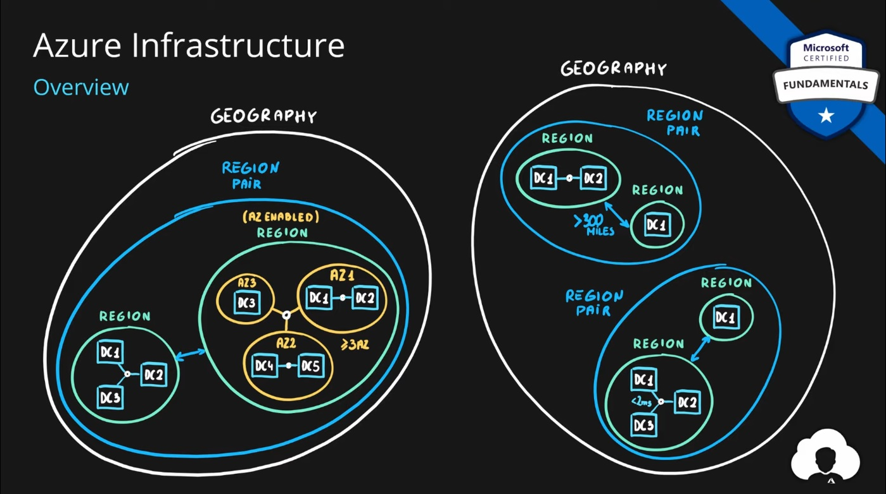

# Azure Global Infrastructure

Selecting a region in Azure is important for several reasons:

    Proximity to Users: The physical location of the Azure region can impact the performance and latency of your applications. Choosing a region closer to your end-users or customers can result in faster response times.

    Compliance and Data Residency: Different regions may have different compliance requirements and data residency laws. Some organizations are required to store data within specific geographic boundaries to comply with regulations, such as GDPR in Europe.

    Availability and Redundancy: Azure regions vary in terms of availability and redundancy. Some regions are designed with greater fault tolerance and offer more extensive disaster recovery options. Choosing a region with the right level of availability is crucial for business continuity.

    Cost Considerations: Pricing can vary between Azure regions. You may find differences in the cost of resources, data transfer, and other services in different regions. It's essential to consider your budget and cost optimization strategies.

    Service Availability: Not all Azure regions offer the same set of services and features. Some services may be in preview or not available in all regions. Ensure that the region you choose supports the specific Azure services and features your application or workload requires.

    Scalability and Capacity: Some regions may have more available capacity and resources than others. If you plan to scale your application or services significantly, you need to choose a region that can accommodate your growth.

    Network Connectivity: Azure regions have varying network connectivity and peering relationships. Select a region with robust network connectivity to ensure smooth data transfers and communication with other services and users.

    Support and Service Level Agreements (SLAs): The level of support and SLAs can differ by region. You may want to choose a region that offers the support and SLA commitments that align with your business needs.

    Disaster Recovery and Backup: If disaster recovery is a priority, you might want to select a secondary region for backup and recovery purposes. Azure provides options for replicating data and services across regions to enhance resilience.

    Testing and Development: You might consider using a different region for testing and development environments to isolate them from production systems while saving costs.

## Key-terms

Redundancy ensures that your storage account meets its availability and durability targets even in the face of failures.

---

Data Center: Are Level 1 in the structure. Each center has its own Power, Cooling and Networking infrastructure. 

    Physical facility
    Hosting for group of networked servers
    Own power, cooling & networking infrastructure

---

Availability Zones: Are Level 2. And it consists of one or more data centers. Availability Zone

    Regional feature
    Grouping of physically separate facilities
    Designed to protect from data center failures
    If zone goes down others continue working
    Two service categories
        Zonal services (Virtual Machines, Disks, etc.)
        Zone-redundant services (SQL, Storage, etc.)
    Not all regions are supported
    Supported region has three or more zones
    A zone is one or more data centers

---

Regions: Are Level 3. And can contain multiple data centers or multiple Availability Zones. 

    Geographical area on the planet
    One but usually more datacenters connected with low-latency network (<2 milliseconds)
    Location for your services
    Some services are available only in certain regions
    Some services are global services, as such are not assigned/deployed in specific region
    Globally available with 50+ regions
    Special government regions (US DoD Central, US Gov Virginia, etc.)
    Special partnered regions (China East, China North)

---

Region Pairs: Are Level 4. And are different regions paired together to ensure stability, if one region fails the other will take over.  North-Europe and West-Europe are paired. 

    Each region is paired with another region making it a region pair
    Region pairs are static and cannot be chosen
    Each pair resides within the same geography*
        Exception is Brazil South
    Physical isolation with at least 300 miles distance (when possible)
    Some services have platform-provided replication
    Planned updates across the pairs
    Data residency maintained for disaster recovery

---

Geographies: Are Level 5. Can contain multiple regions or region pairs.

    Discrete market
    Typically contains two or more regions
    Ensures data residency, sovereignty, resiliency, and compliance requirements are met
    Fault tolerant to protect from region wide failures
    Broken up into areas
        Americas,
        Europe,
        Asia Pacific,
        Middle East and Africa
    Each region belongs only to one Geography

---

Azure services that support availability zones, including zonal and zone-redundant offerings, are continually expanding.

Three types of Azure services support availability zones: zonal, zone-redundant, and always-available services. You can combine all three of these approaches to architecture when you design your reliability strategy.

    Zonal services: A resource can be deployed to a specific, self-selected availability zone to achieve more stringent latency or performance requirements. Resiliency is self-architected by replicating applications and data to one or more zones within the region. Resources are aligned to a selected zone. For example, virtual machines, managed disks, or standard IP addresses can be aligned to a same zone, which allows for increased resiliency by having multiple instances of resources deployed to different zones.

    Zone-redundant services: Resources are replicated or distributed across zones automatically. For example, zone-redundant services replicate the data across multiple zones so that a failure in one zone doesn't affect the high availability of the data. 

    Always-available services: Always available across all Azure geographies and are resilient to zone-wide outages and region-wide outages.

## Opdracht

### Gebruikte bronnen

* __Geographies, Regions, Region Pirs & Availability Zones__ (https://www.youtube.com/watch?app=desktop&v=C-nNw1mGwzE&ab_channel=AdamMarczak-AzureforEveryone)
* __Availability Zones__ (https://learn.microsoft.com/en-us/azure/reliability/availability-zones-service-support)

### Resultaat

* __Azure Global Infrastructe__

