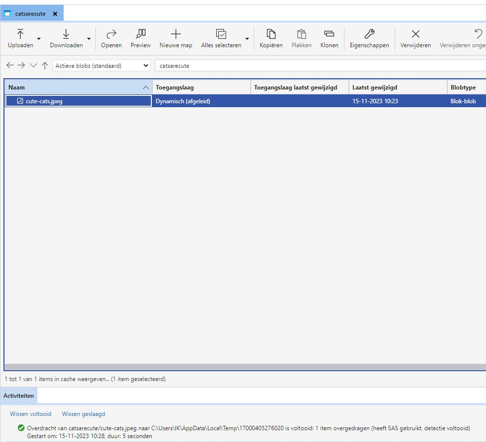

# Azure Storage Account
[Geef een korte beschrijving van het onderwerp]

## Key-terms

## Opdracht

### Gebruikte bronnen

* __Use Explorer__ (https://learn.microsoft.com/en-us/azure/vs-azure-tools-storage-manage-with-storage-explorer?tabs=windows#sign-in-to-azure)
* __Host Static Website__ (https://learn.microsoft.com/en-us/azure/storage/blobs/storage-blob-static-website-how-to?tabs=azure-portal)

### Resultaat

* __Created Storage Account__

* __Created Container__

* __Pulled Container Content in Explorer__

