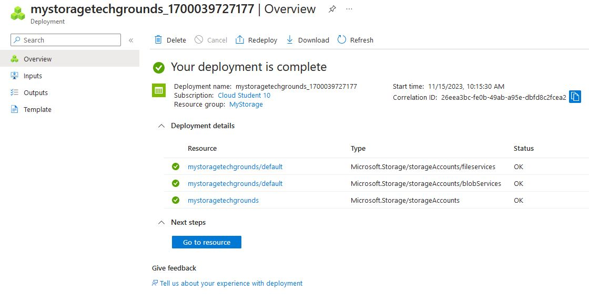

# Azure Storage Account

Data in een Storage Account is secure, highly available, durable en massively scalable. Alle data in een Storage Account is bereikbaar via het internet met HTTP en HTTPS. Omdat het makkelijk te bereiken is moet je goed opletten dat alleen de juiste identiteiten permissies hebben om bij de data te komen.

## Key-terms

An Azure managed disk is a virtual hard disk (VHD). You can think of it like a physical disk in an on-premises server but, virtualized. Azure-managed disks are stored as page blobs

Azure Storage services offer the following benefits for application developers and IT professionals:

    Durable and highly available. Redundancy ensures that your data is safe in the event of transient hardware failures. You can also opt to replicate data across data centers or geographical regions for additional protection from local catastrophe or natural disaster. Data replicated in this way remains highly available in the event of an unexpected outage.
    Secure. All data written to an Azure storage account is encrypted by the service. Azure Storage provides you with fine-grained control over who has access to your data.
    Scalable. Azure Storage is designed to be massively scalable to meet the data storage and performance needs of today's applications.
    Managed. Azure handles hardware maintenance, updates, and critical issues for you.
    Accessible. Data in Azure Storage is accessible from anywhere in the world over HTTP or HTTPS. Microsoft provides client libraries for Azure Storage in a variety of languages, including .NET, Java, Node.js, Python, PHP, Ruby, Go, and others, as well as a mature REST API. Azure Storage supports scripting in Azure PowerShell or Azure CLI. And the Azure portal and Azure Storage Explorer offer easy visual solutions for working with your data.

Azure Storage offers highly available, massively scalable, durable, and secure storage for a variety of data objects in the cloud. Azure Storage data objects are accessible from anywhere in the world over HTTP or HTTPS via a REST API.

Storage container: To drop items in

* __Azure Storage data services__

The Azure Storage platform includes the following data services:

    Azure Blobs: A massively scalable object store for text and binary data. Also includes support for big data analytics through Data Lake Storage Gen2.
    Azure Files: Managed file shares for cloud or on-premises deployments.
    Azure Elastic SAN (preview): A fully integrated solution that simplifies deploying, scaling, managing, and configuring a SAN in Azure.
    Azure Queues: A messaging store for reliable messaging between application components.
    Azure Tables: A NoSQL store for schemaless storage of structured data.
    Azure managed Disks: Block-level storage volumes for Azure VMs.

## Opdracht

### Gebruikte bronnen

* __Azure Storage Data Services__ (https://learn.microsoft.com/en-us/azure/storage/common/storage-introduction?toc=%2Fazure%2Fstorage%2Fblobs%2Ftoc.json&bc=%2Fazure%2Fstorage%2Fblobs%2Fbreadcrumb%2Ftoc.json)
* __Static vs Dynamic Website__ (https://www.jeewangarg.com/blog/difference-between-static-and-dynamic-website)
* __Disk Types__ (https://learn.microsoft.com/en-us/azure/virtual-machines/disks-types)
* __Use Explorer__ (https://learn.microsoft.com/en-us/azure/vs-azure-tools-storage-manage-with-storage-explorer?tabs=windows#sign-in-to-azure)
* __Host Static Website__ (https://learn.microsoft.com/en-us/azure/storage/blobs/storage-blob-static-website-how-to?tabs=azure-portal)

### Resultaat

* __Created Storage Account__

* __Created Container__

* __Pulled Container Content in Explorer__

* __Static Website Created__

* __Website Works__

