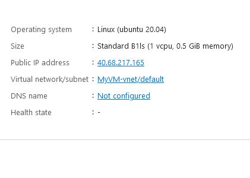
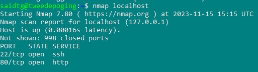
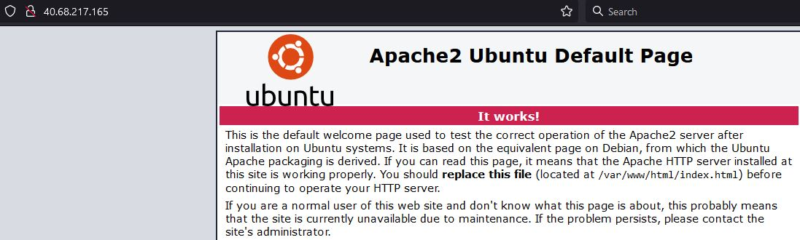
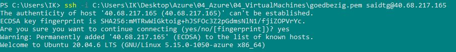

# Virtual Machines

An Azure virtual machine gives you the flexibility of virtualization without having to buy and maintain the physical hardware that runs it. However, you still need to maintain the virtual machine by performing tasks, such as configuring, patching, and installing the software that runs on it.

Azure virtual machines can be used in various ways. Some examples are:

    Development and test – Azure virtual machines offer a quick and easy way to create a computer with specific configurations required to code and test an application.
    Applications in the cloud – Because demand for your application can fluctuate, it might make economic sense to run it on a virtual machine in Azure. You pay for extra virtual machines when you need them and shut them down when you don’t.
    Extended datacenter – virtual machines in an Azure virtual network can easily be connected to your organization’s network.

## Key-terms

        #!/bin/bash

        sudo su

        apt update

        apt install apache2 -y

        ufw allow 'Apache'

        systemctl enable apache2

        systemctl restart apache2

A Network Security Group (NSG) contains as many rules as desired, within Azure subscription limits

A network interface (NIC) enables an Azure virtual machine (VM) to communicate with internet, Azure, and on-premises resources.

In Azure when you deploy a VM the following components gets deployed along :

Network Interface (NIC)
Network Security Group
Public IP
Disk

A NIC is a component which holds the Public IP and the private IP of the VM. Also you can associate the NSG to the NIC.

NIC can be deployed in a subnet of the Virtual Network. 

## Opdracht
### Gebruikte bronnen

* __Virtual Machines__ (https://learn.microsoft.com/en-us/azure/virtual-machines/overview)
* __NSG__ (https://learn.microsoft.com/en-us/azure/virtual-network/network-security-groups-overview)
* __NIC__ (https://learn.microsoft.com/en-us/azure/virtual-network/virtual-network-network-interface?tabs=azure-portal)

### Resultaat

* __VM Public IP__

* __Open Ports__

* __Working Browser__

* __Working Server__

