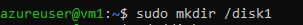
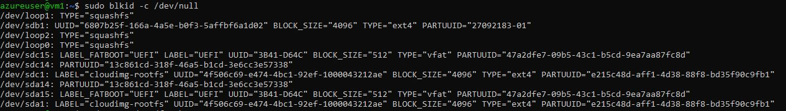
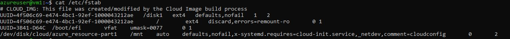
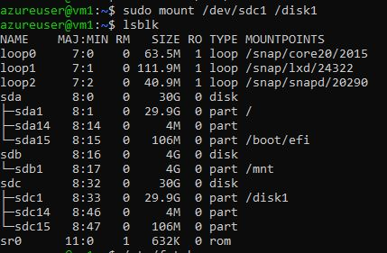
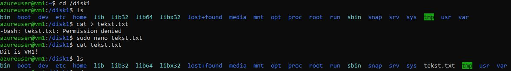
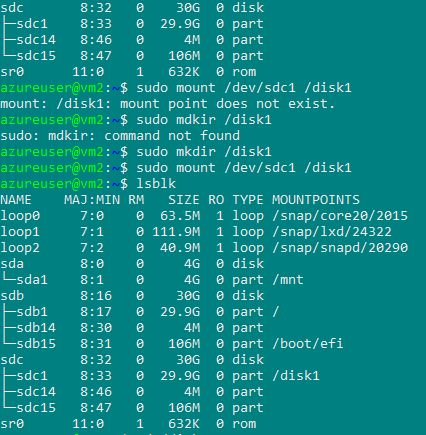
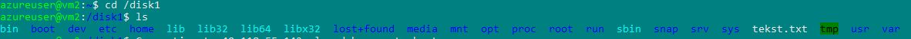
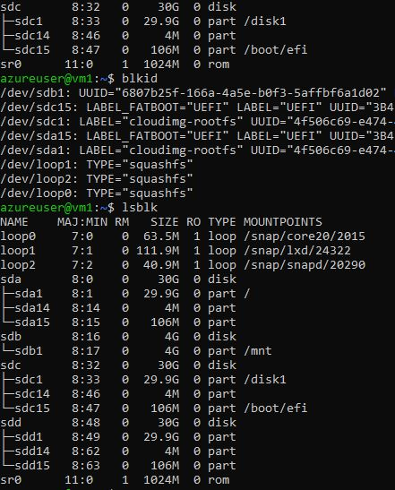

# Azure Disk Storage

Reboot to make changes visible!

## Key-terms

sudo blkid -c /dev/null = show disk partitions, UUID, file type

sudo nano /etc/fstab = Add UUID 

The best command to use is lsblk -f. It will list all the devices and partitions, how they are mounted (if at all) and the tree structure of the devices in the case of using LVM, crypto_LUKS, or multiple volume groups on the same drive.

## Opdracht

### Gebruikte bronnen

* Partition and Mount a Disk (https://learn.microsoft.com/en-us/azure/virtual-machines/linux/attach-disk-portal?tabs=ubuntu)
* File systems (https://linuxiac.com/linux-file-system-types-explained-which-one-should-you-use/)

### Ervaren problemen

I first had to partition and format before I could mount. I couldn't read the file in my 2nd VM until after I rebooted the VM2.

### Resultaat

* __Make Directory in VM 1__

* __Show Disk and UUID__

* __Add UUID in Nano__

* __Mount Disk in VM 1__

* __Made a text file__

* __Make Directory and Mount Disk in VM 2__

* __Show file on made on VM 1 in VM 2__

* __Created New Disk with Snap SDD__

