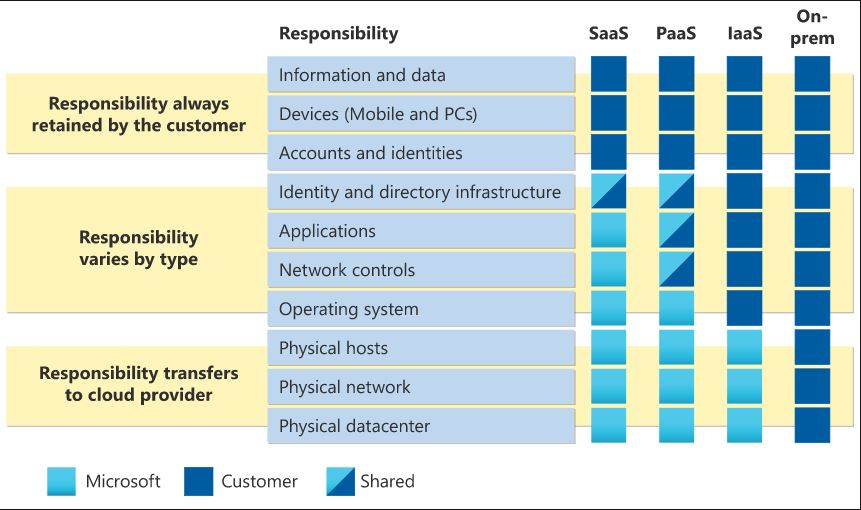

# Shared Responsibility

Shared Responsibility is about the division of responsibility. Which security tasks is handled by the Cloud provider and which ones by the customer. The workload depends on whether its hosted on Software as a Service (SaaS), Platform as a Service (PaaS), Infrastructure as a Service (IaaS), or in an on-premises datacenter.

## Key-terms

SaaS Software as a Service: Puts most of the responsibility with the provider.

PaaS Platform as a Service: Shares the responsibility between provider and customer, slight more on the provider.

IaaS Infrastructure as a Service: Puts most of the responsibility with the customer.

On-Premise: The customer controls everything.

## Opdracht

### Gebruikte bronnen

* __Shared Responsibility Model__ (https://learn.microsoft.com/en-us/azure/security/fundamentals/shared-responsibility)

### Resultaat

* __Shared Responsibility Model__

