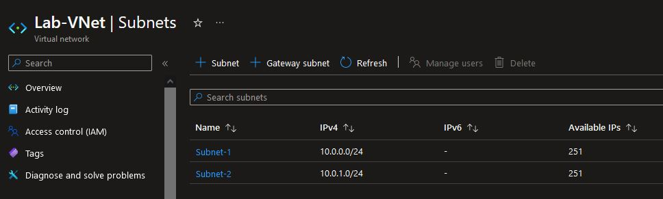

# Azure Virtual Network

Why use an Azure virtual network?

Key scenarios that you can accomplish with a virtual network include:

    Communication of Azure resources with the internet.

    Communication between Azure resources.

    Communication with on-premises resources.

    Filtering of network traffic.

    Routing of network traffic.

    Integration with Azure services.

Azure virtual networks (VNets) ensure that resources such as VMs, web apps and databases can communicate with each other, with users on the internet and with machines on-premises.

VNets have the following responsibilities:

     (Network) isolation and segmentation
     Internet communications
     Communication between Azure resources
     Communication with on-premises resources
     Route network traffic
     Network traffic filtering
     Connect to other VNets

When you create a new VNet, you determine a private IP range for your network. You can create subnets within that range.

There are three ways to connect your network to an on-premises network:

     Point-to-site VPNs:
         The Azure VNet is accessed with a VPN from an on-prem computer.
     Site-to-site VPNs:
         The on-prem VPN device or gateway is connected to the Azure VPN Gateway. This effectively gives you 1 large local network.
     Azure Express Route:
         This is a physical connection from your local environment to Azure.

You can also connect two Azure VNets using virtual network peering. This is made possible by user-defined Routing (UDR). Peering is possible with VNets in different regions.

An easy way to find out how traffic is routed is to look in a NIC under "effective routes". This contains the routes and the route tables associated with the routes.

## Key-terms
[Schrijf hier een lijst met belangrijke termen met eventueel een korte uitleg.]

## Opdracht
### Gebruikte bronnen

* __Virtual Network__ (https://learn.microsoft.com/en-us/azure/virtual-network/virtual-networks-overview)

### Resultaat

