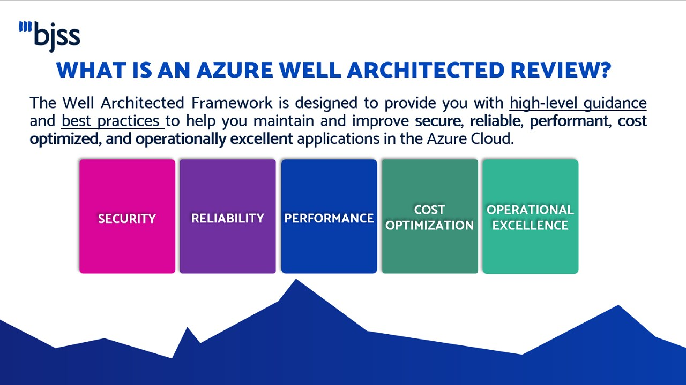
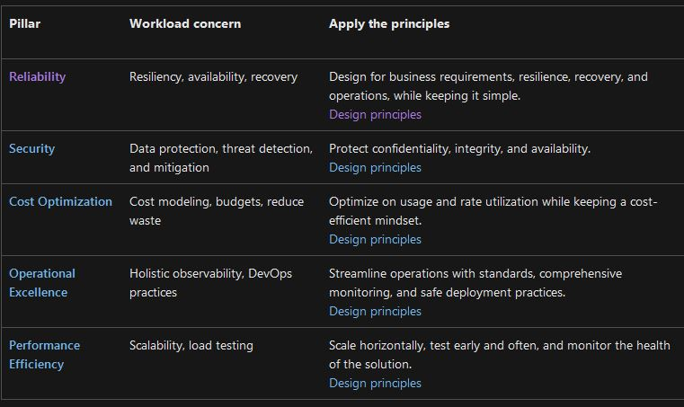

# Well Architected Framwork

Well Architected Framework is a tool to help with the decision making process.

## Key-terms

The Azure Well-Architected Framework helps you optimize individual workloads by making sure each one is designed according to best practices, while the Cloud Adoption Framework provides an overarching strategy for migrating to the cloud and governing it over time.

Right > Fast > Cheap = Pick 2

Security: The ability to protect information, systems, and assets while delivering business value through risk assessments and mitigation strategies

Reliability: The ability of a system to recover from infrastructure or service failures, dynamically acquire computing resources to meet demand, and mitigate disruptions such as misconfigurations or transient network issues

Performance Efficiency: The ability to use computing resources efficiently to meet system requirements, and to maintain that efficiency as demand changes and technologies evolve

Cost Optimization: The ability to avoid or eliminate unneeded cost or suboptimal resources

Operational Excellence: The ability to run and monitor systems to deliver business value and to continually improve supporting processes and procedures

* __Pillars of Well Architected Framwork (WAF)__

  * Reliability
  * Security
  * Cost Optimization
  * Operational Excellence
  * Performance Efficiency

  Implementing the pillars of the Well-Architected Framework in Azure involves leveraging various cloud services and following best practices. Here's a brief overview of how you can address each pillar using Azure services:

    Reliability:
        Azure Availability Zones: Distribute applications across multiple data centers to ensure high availability.
        Azure Traffic Manager: Route traffic to healthy endpoints in different regions to improve reliability.
        Azure Site Recovery: Implement disaster recovery plans to ensure business continuity.

    Security:
        Azure Active Directory (AAD): Use AAD for identity and access management, implementing features like Multi-Factor Authentication (MFA).
        Azure Key Vault: Safeguard cryptographic keys and secrets used by cloud applications and services.
        Azure Security Center: Continuously monitor and improve the security posture of your resources.

    Cost Optimization:
        Azure Cost Management + Billing: Monitor, allocate, and optimize costs using Azure's cost management tools.
        Azure Reservations: Commit to a one- or three-year plan for specific Azure services to achieve significant cost savings.
        Azure Policy: Enforce organizational standards and requirements to control costs.

    Operational Excellence:
        Azure Monitor and Azure Log Analytics: Collect and analyze telemetry data to gain insights into the performance and operation of your applications.
        Azure Automation: Automate routine tasks and processes to increase operational efficiency.
        Azure DevOps: Implement continuous integration and continuous deployment (CI/CD) pipelines for efficient application delivery.

    Performance Efficiency:
        Azure Virtual Machines (VMs): Choose the right VM size and series based on workload requirements.
        Azure Blob Storage:
            Implement Azure Content Delivery Network (CDN) for fast and efficient content delivery.
            Leverage Azure Blob Storage tiers for cost-effective data storage.
        Azure Kubernetes Service (AKS): Use AKS for containerized applications, providing scalability and orchestration.

Remember, the specific Azure services and tools you use will depend on your workload and application requirements. Regularly review and update your architecture to incorporate new features and improvements in Azure services, ensuring ongoing alignment with the Well-Architected Framework principles. Azure's documentation and best practice guides can provide more detailed guidance for each of these pillars.

## Opdracht
### Gebruikte bronnen
* __Azure Well-Architected Framework__ (https://learn.microsoft.com/en-us/azure/well-architected/what-is-well-architected-framework)
* __Using the WAF__ (https://www.youtube.com/watch?v=vTjasx3ahjM&ab_channel=JohnSavill%27sTechnicalTraining)

### Resultaat

