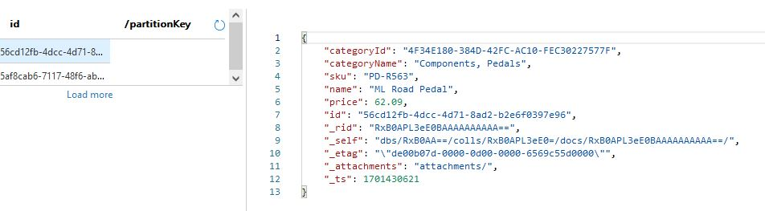
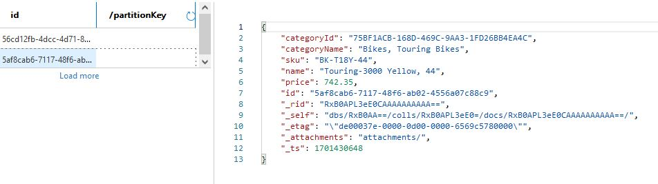
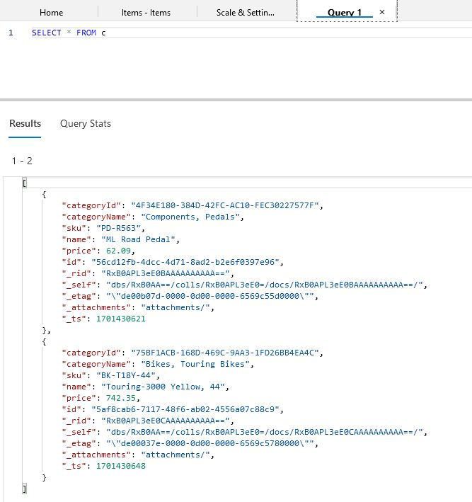
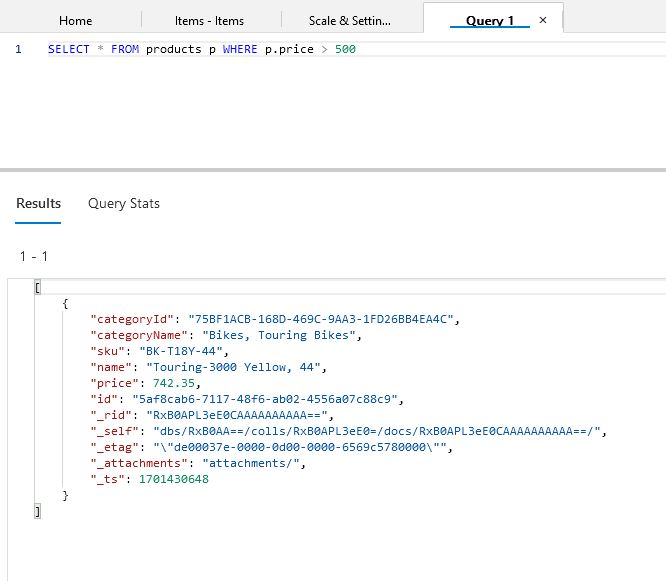

# CosmosDB

CosmosDB, developed by Microsoft Azure, is a globally distributed, multi-model database service designed to address various challenges associated with building highly responsive and scalable applications. Here are the key aspects related to CosmosDB:

    Problem Solving:
        Global Distribution: CosmosDB allows you to distribute your data globally, enabling low-latency access for users around the world.
        Multi-Model Support: It supports multiple data models, including document, graph, key-value, table, and column-family, providing flexibility for different application requirements.
        Automatic and Instant Scalability: CosmosDB can scale both throughput and storage automatically based on demand. It also provides instant, consistent, and predictable performance.

    Key Terms:
        Containers: Containers are the fundamental unit of scalability and billing in CosmosDB. They represent a collection of items, such as documents, graphs, or tables.
        Throughput: Throughput in CosmosDB refers to the amount of work that a database can handle in terms of queries per second (QPS) and input/output operations per second (IOPS).
        Partitioning: CosmosDB uses automatic partitioning to distribute data across multiple physical partitions, allowing for horizontal scaling.

    On-Premises Setting:
        CosmosDB is a fully managed cloud service and is not designed to be deployed on-premises. However, if you are looking for a similar database solution for on-premises deployment, you might consider Azure Cosmos DB's API for MongoDB, which is compatible with MongoDB and can be used on-premises.

    Combining with Other Services:
        Azure Functions: You can use Azure Functions to create serverless applications that interact with CosmosDB. Functions can be triggered by changes in the CosmosDB data.
        Azure Logic Apps: Logic Apps can be used to create workflows that connect CosmosDB with other Azure services or external systems.
        Azure Synapse Analytics (formerly SQL Data Warehouse): You can integrate CosmosDB with Synapse Analytics for powerful analytics and reporting capabilities.

    Difference from Similar Services:
        MongoDB: CosmosDB's API for MongoDB provides MongoDB compatibility, but it also supports other data models. It offers global distribution and multi-model capabilities that MongoDB may not have out of the box.
        Cassandra: While both CosmosDB and Cassandra are designed for horizontal scaling and global distribution, CosmosDB abstracts away much of the operational complexity associated with managing Cassandra clusters.
        Amazon DynamoDB: CosmosDB shares some similarities with DynamoDB in terms of global distribution and automatic scaling, but they have different data models, consistency models, and APIs.

In summary, CosmosDB aims to solve challenges related to global distribution, scalability, and multi-model support, making it suitable for a wide range of applications with diverse requirements. It offers integration with other Azure services, and its key terms and concepts revolve around containers, throughput, and automatic partitioning. In an on-premises setting, alternatives like Azure Cosmos DB's API for MongoDB might be considered.

## Opdracht
### Gebruikte bronnen

* __Azure Cosmos DB__ (https://learn.microsoft.com/en-us/azure/cosmos-db/introduction)

### Resultaat

* __Show Item 1__

* __Show Items 2__

 

* __Query both Items__

 

* __Query item with price above 500__

 
