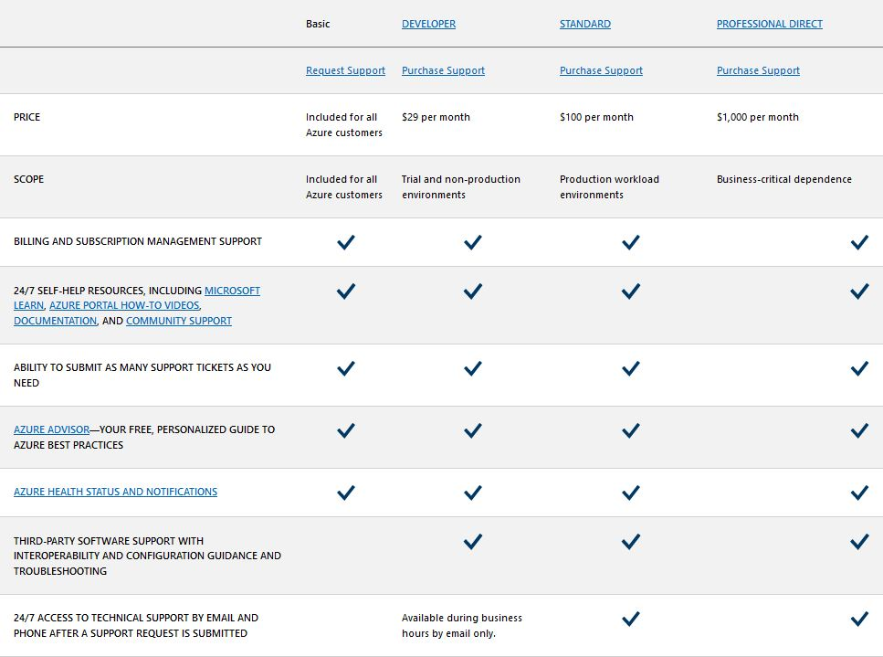

# Theory

    Azure Containers:
        Purpose: Azure Containers provide a way to deploy, manage, and scale containerized applications using technologies like Docker and Kubernetes.
        Key Terms: Docker, Kubernetes, Azure Kubernetes Service (AKS), Azure Container Instances (ACI).

    Azure Support Plans:
        Purpose: Azure Support Plans offer different levels of support to help customers resolve issues, gain access to technical expertise, and receive guidance for Azure services.
        Key Terms: Basic support, Standard support, Professional Direct, Premier Support.

    Azure Advisor:
        Purpose: Azure Advisor is a service that provides personalized recommendations to optimize your Azure resources for performance, security, and cost-efficiency.
        Key Terms: Recommendations, Best practices, Cost optimization, Security.

    Azure App Configuration:
        Purpose: Azure App Configuration is a centralized configuration service that allows you to manage application settings and feature flags in a dynamic and secure manner.
        Key Terms: Key-value pairs, Feature flags, Configuration settings, Centralized management.

    Azure Monitor Logs:
        Purpose: Azure Monitor Logs, often associated with Azure Monitor, allows you to collect, analyze, and act on telemetry data from various Azure resources, applications, and systems.
        Key Terms: Log Analytics, Query Language (Kusto Query Language or KQL), Metrics, Alerts.

These services collectively contribute to building, managing, and optimizing applications and infrastructure in the Azure cloud. They address different aspects such as containerized application deployment, support and assistance, optimization recommendations, configuration management, and monitoring and logging for better insights into system behavior.

## Opdracht
### Gebruikte bronnen

* __Containers__ (https://learn.microsoft.com/en-us/azure/aks/intro-kubernetes)
* __Support Plans__ (https://azure.microsoft.com/en-us/support/plans)
* __Advisor__ (https://learn.microsoft.com/en-us/azure/advisor/advisor-overview)
* __App Configuration__ (https://learn.microsoft.com/en-us/azure/azure-app-configuration/overview)
* __Monitor Logs__ (https://learn.microsoft.com/en-us/azure/azure-monitor/logs/data-platform-logs)

---

* __Support Plans__ 

