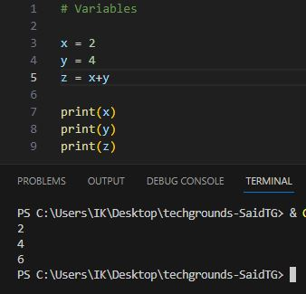
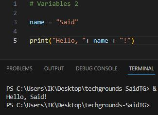
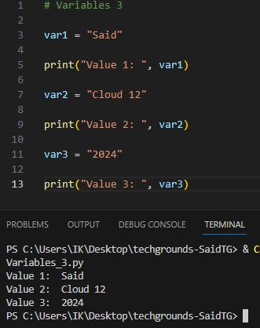

# Variables

A variable can store a value. This value can then be accessed with the variable name in the code.

__Exercise 1:__

    Create a new script.
    Create two variables x and y. Assign a numerical value to both variables.
    Print the values of x and y.
    Create a third variable named z. The value of z should be the sum of x and y.
    Print the value of z.

* Script: [Variable_1.py](Python.py/09_2_Variables_1.py)

---

__Exercise 2:__

    Create a new script.
    Create a variable called name. The value of name should be your name.
    Print the text “Hello, YOURNAME!”. Use the variable name in the print statement. Example output:

* Script: [Variable_2.py](Python.py/09_2_Variables_2.py)

---
__Exercise 3:__

    Create a new script.
    Create a variable and assign a value to it.
    Print the text “Value 1: VALUE1”.
    Change the value of that same variable.
    Print the text “Value 2: VALUE2”.
    Change the value of that same variable.
    Print the text “Value 3: VALUE3”.
    Example output:

* Script: [Variable_3.py](Python.py/09_2_Variables_3.py)

# Sources

* https://www.geeksforgeeks.org/python-variables/
* https://www.w3schools.com/python/python_variables.asp