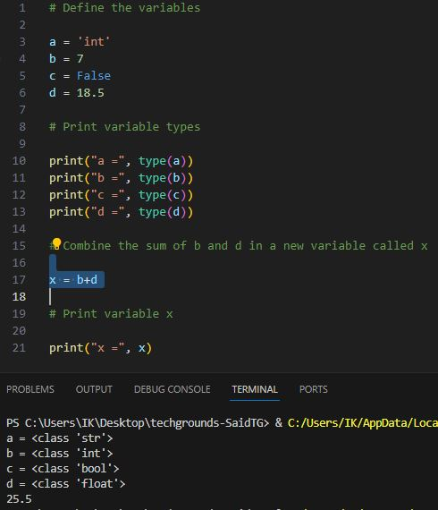
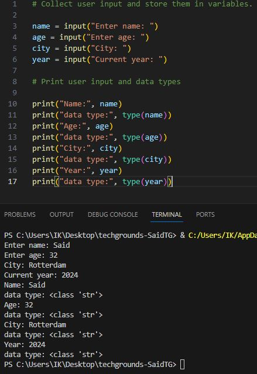

#  Data Types and Comments

The most important data types in Python:

* boolean;  
    A binary state that is either True or False.
    boolean = True

* String;  
    Technically an array of characters. Strings are denoted using “ ” double quotes or ‘ ’ single quotes.
    string = "This is a string"
    Int

* Integer;  
    A whole number. Ints can be both positive and negative.
    
    

* Float;  
    A floating-point number is a decimal number.
    floating_point = 18.5

---

__Exercise 1__

* Create a new script.
* Copy the code below into your script.

    a = 'int'

    b = 7

    c = False

    d = "18.5"

* Determine the data types of all four variables ( a, b, c, d) using a built-in function.

* Make a new variable x and give it the value b + d. Print the value of x. This will raise an error. Fix it so that print(x) prints a float.

* Write a comment above every line of code that tells the reader what is going on in your script.

Script: [Exercise1.py](Python.py/09_3_DataTypesAndComments_1.py)

---

__Exercise 2__

* Create a new script.

* Use the input() function to get input from the user. Store that input in a variable.

* Find out what data type the output of input() is. See if it is different for different kinds of input (numbers, words, etc.).

Script: [Exercise2.py](Python.py/09_3_DataTypesAndComments_2.py)

# Sources

* https://www.w3schools.com/python/python_datatypes.asp
* https://www.w3schools.com/python/python_comments.asp
* https://www.w3schools.com/python/python_user_input.asp
