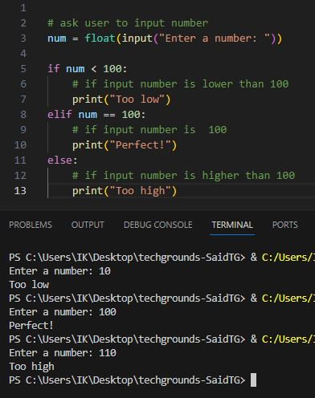
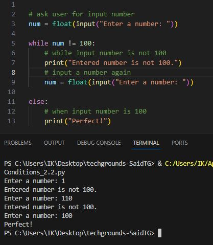

# Conditions

Python supports the usual logical conditions from mathematics:

    Equals: a == b
    Not Equals: a != b
    Less than: a < b
    Less than or equal to: a <= b
    Greater than: a > b
    Greater than or equal to: a >= b

These conditions can be used in several ways, most commonly in "if statements" and loops.

An "if statement" is written by using the if keyword.

---

__Exercise 1:__

* Create a new script.
* Use the input() function to ask the user of your script for their name.  
If the name they input is your name, print a personalized welcome message.  
If not, print a different personalized message.

    

* Script: [Exercise1.py](Python.py/09_4_Conditions_1.py)

---

Exercise 2:

* Create a new script.
* Ask the user of your script for a number. Give them a response based on whether the number is higher than, lower than, or equal to 100.

    

* Script: [Exercise2.1.py](Python.py/09_5_Conditions_2.1.py)

* Make the game repeat until the user inputs 100.

    

* Script: [Exercise2.2.py](Python.py/09_5_Conditions_2.2.py)

# Sources

* https://www.w3schools.com/python/python_conditions.asp
* https://www.includehelp.com/python/read-input-as-a-float.aspx