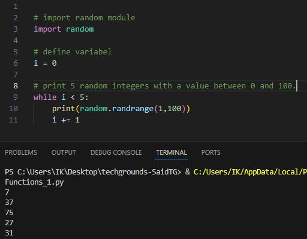
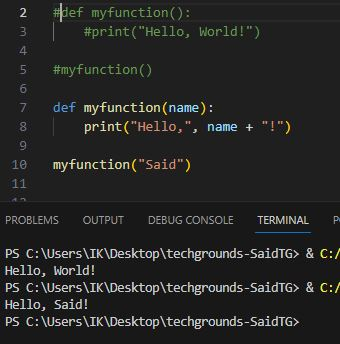
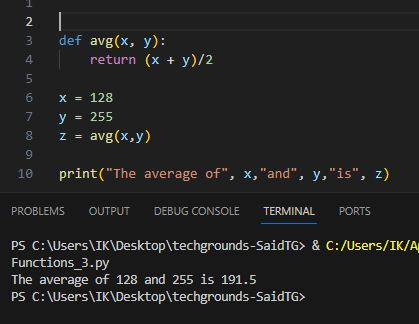

# Functions

A function is a block of code which only runs when it is called.  
You can pass data, known as parameters, into a function.  
A function can return data as a result.

---

__Exercise 1:__

* Create a new script.
* Import the random package.
* Print 5 random integers with a value between 0 and 100.

    

* Script: [Exercise1.py](Python.py/09_6_Functions_1.py)

---

__Exercise 2:__

* Create a new script.
* Write a custom function myfunction() that prints “Hello, world!” to the terminal. Call myfunction.
* Rewrite your function so that it takes a string as an argument. Then, it should print “Hello, NAME!”.

    

* Script: [Exercise2.py](Python.py/09_6_Functions_2.py)

---

__Exercise 3:__

* Create a new script.
* Copy the code below into your script.

        def avg():
        # write your code here
        # you are not allowed to edit any code below here

        x = 128
        y = 255
        z = avg(x,y)

        print("The average of",x,"and",y,"is",z)

* Write the custom function avg() so that it returns the average of the given parameters.  
You are not allowed to edit any code below the second comment.

    

* Script: [Exercise3.py](Python.py/09_7_Functions_3.py)

# Sources

* https://www.w3schools.com/python/module_random.asp
* https://www.w3schools.com/python/python_functions.asp
* https://www.w3schools.com/python/ref_random_randrange.asp