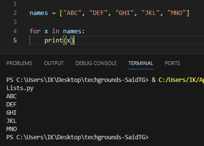
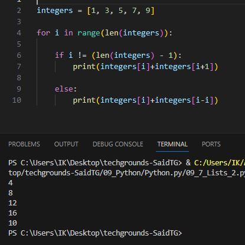

# Lists

Lists are used to store multiple items in a single variable.

Lists are one of 4 built-in data types in Python used to store collections of data, the other 3 are Tuple, Set, and Dictionary, all with different qualities and usage.

Lists are created using square brackets:

---

__Exercise 1:__

* Create a new script.
* Create a variable that contains a list of five names.
* Loop over the list using a for loop.  
Print every individual name in the list on a new line.

    

* Script: [Exercise1.py](Python.py/09_7_Lists_1.py)

---

__Exercise 2:__

* Create a new script.
* Create a list of five integers.
* Use a for loop to do the following for every item in the list:
    * Print the value of that item added to the value of the next item in the list.
    * If it is the last item, add it to the value of the first item instead (since there is no next item).

    

* Script: [Exercise2.py](Python.py/09_7_Lists_2.py)

# Sources

* https://www.w3schools.com/python/python_lists.asp
* https://www.w3schools.com/python/python_lists_loop.asp