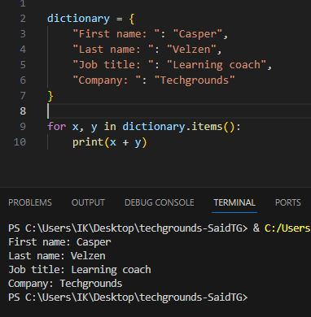
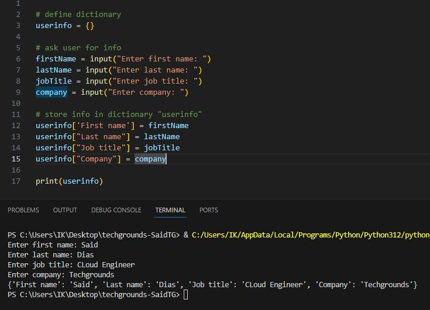
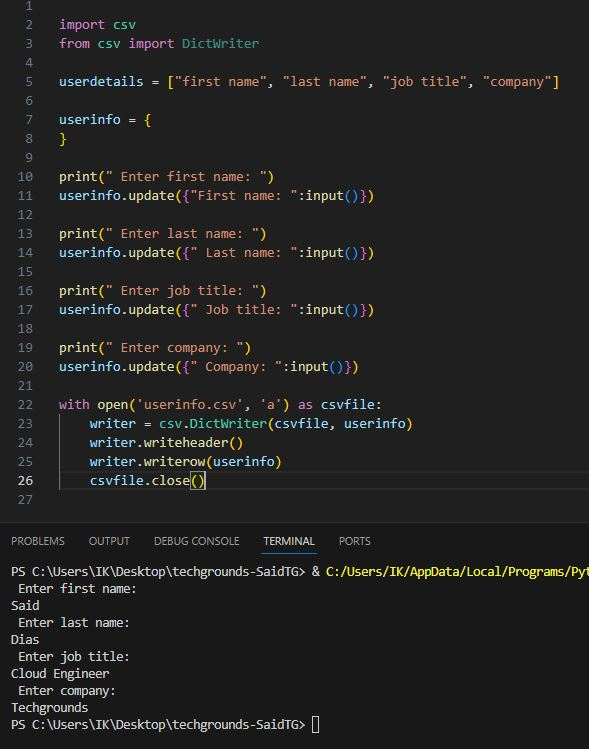
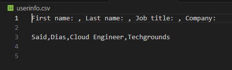

# Key-Value Pairs

A Python dictionary is a collection of key-value pairs where each key is associated with a value.

A value in the key-value pair can be a number, a string, a list, a tuple, or even another dictionary.  
In fact, you can use a value of any valid type in Python as the value in the key-value pair.

---

__Exercise 1:__

* Create a new script.
* Create a dictionary with the following keys and values:

               Key   |   Value
                     
        First name   |   Casper

         Last name   |   Velzen

         Job title   |   Learning coach

           Company   |   Techgrounds

* Loop over the dictionary and print every key-value pair in the terminal.

    

* Script: [Exercise1.py](Python.py/09_8_KeyValuePairs_1.py)

---

__Exercise 2:__

* Create a new script.
* Use user input to ask for their information (first name, last name, job title, company).  
Store the information in a dictionary.

    

* Script [Exercise2.1.py](Python.py/09_8_KeyValuePairs_2.1.py)

.

* Write the information to a csv file (comma-separated values).  
The data should not be overwritten when you run the script multiple times.

    

    

* Script: [Exercise2.2.py](Python.py/09_8_KeyValuePairs_2.2.py)

* .csv file: [userinfo.csv](userinfo.csv)

---

# Sources

* https://www.w3schools.com/python/python_dictionaries_loop.asp
* https://www.w3schools.com/python/python_dictionaries.asp
* https://bobbyhadz.com/blog/python-add-user-input-to-dictionary
* https://www.geeksforgeeks.org/how-to-save-a-python-dictionary-to-a-csv-file/
* https://www.sololearn.com/en/Discuss/2672086/python-how-can-i-append-data-to-a-csv-file-without-overwriting-other-colums