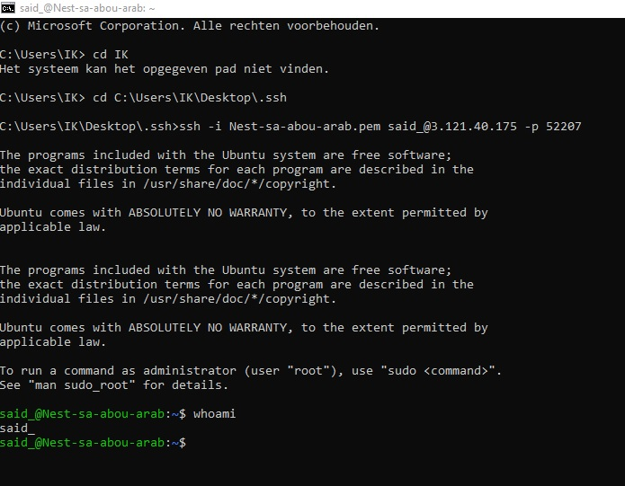

# Setting Up
Tijdens deze oefening moet er verbinding gemaakt worden met een VM in Frankfurt. Hiervoor is OpenSSH gebruikt.
## Key-terms
VM = Virtual Machine
Open SSH = Open source Secure Shell protocol
## Opdracht

### Gebruikte bronnen
* https://www.clickittech.com/aws/connect-ec2-instance-using-ssh/

### Ervaren problemen
Kon niet verbinden met locatie van PEM bestand. Moest dus eerst locatie van map aanduiden van PEM bestand door __cd__ te gebruiken en maplocatie.

### Resultaat
__whoami__ ingetypt en zag toen mijn username.

