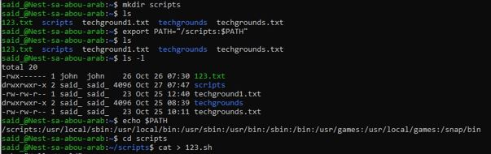
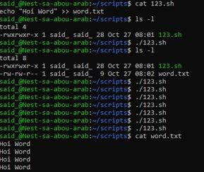
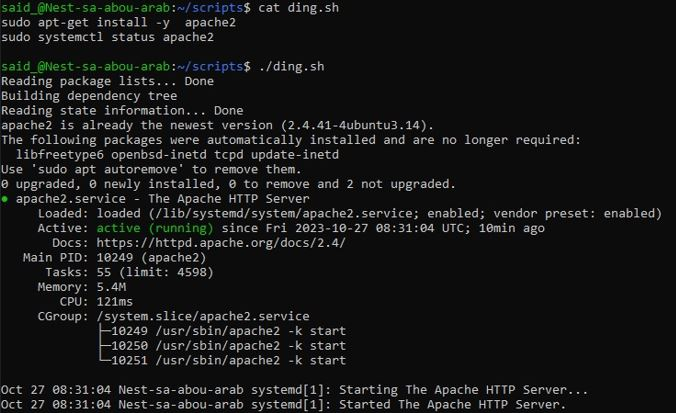
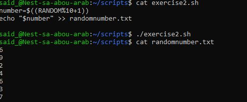
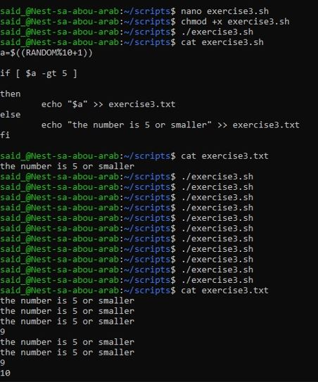

# Bash Scripts

Verschillende scripts gemaakt die commands uitvoeren. Toegevoegd aan nieuwe directory. Deze toegevoegd aan PATH. Script heeft httpd geïnstalleerd. Script gemaakt die een willekeurig nummer naar tekstbestand schrijft als hoger dan 5 of anders een zin tekst.

## Opdracht
### Gebruikte bronnen

__Exercise 1__

* Create directory (https://manpages.ubuntu.com/manpages/trusty/man2/mkdir.2.html)
* Add script to PATH (https://phoenixnap.com/kb/linux-add-to-path#:~:text=PATH%20is%20an%20environment%20variable,command%20without%20specifying%20a%20path)
* Append line of text to file (https://www.tutorialspoint.com/append-lines-to-a-file-in-linux)
* Install httpd and check status (https://www.javatpoint.com/install-httpd-ubuntu)
* Automate saying ''Yes'' to all (https://stackoverflow.com/questions/7642674/how-do-i-script-a-yes-response-for-installing-programs)

__Exercise 2__ 

* Generate random number (https://www.tutorialspoint.com/guide-to-generate-random-numbers-in-linux)

__Exercise 3__

* If/else (https://tecadmin.net/if-then-else-elif-in-bash-shell-scripting/)
* Number greater than (https://stackoverflow.com/questions/16034749/if-elif-else-statement-issues-in-bash)

### Resultaat

* Created directory and added to PATH.

* Script that adds a line of text to a file when executed.

* Script that installs httpd/apache2 that says ''Yes'' to all and checks status.

* Generates random number and appends to file.

* Script writes random number to file if greater than 5 or text if smaller than 5.

