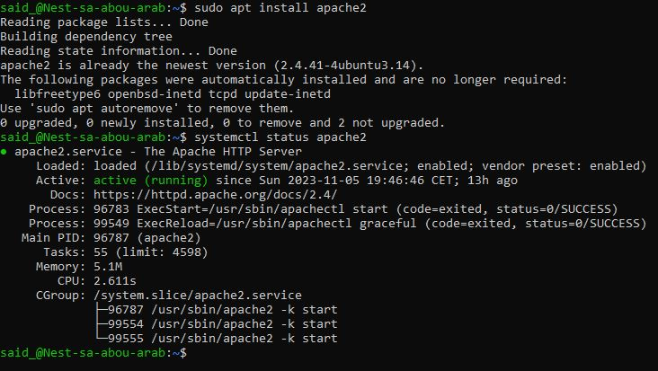
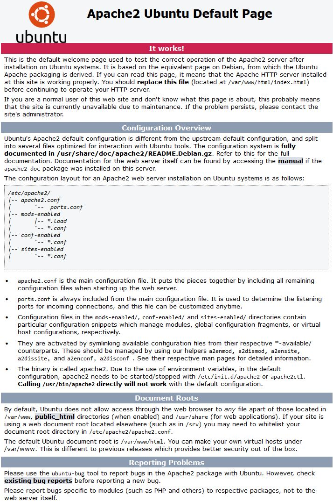
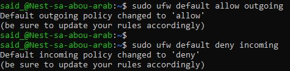
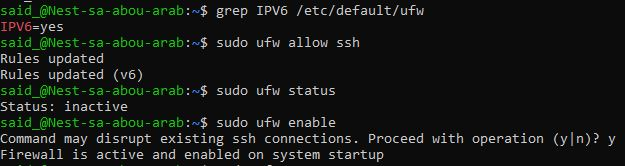
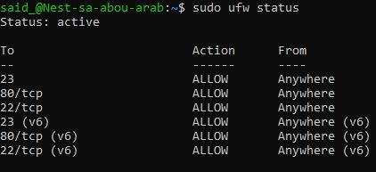
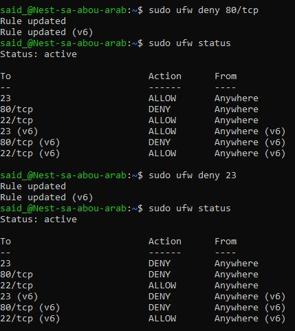
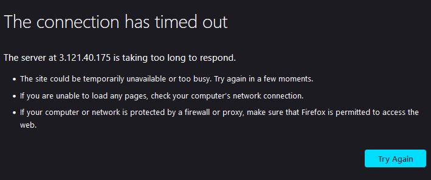

# Firewalls

Informatie opgezocht over de verschillende soorten firewalls. Via de Terminal een webserver geinstalleerd en Ports geblokkeerd via UFW firewall.

## Key-terms
    1. Hardware Firewalls: These firewalls are implemented as a physical appliance deployed in an organization’s server room or data center. While these firewalls have the advantage of running as “bare metal” and on hardware designed specifically for them, they are also constrained by the limitations of their hardware (number of network interface cards (NICs), bandwidth limitations, etc.).

    2. Software Firewalls: Software firewalls are implemented as code on a computer. These firewalls include both the firewalls built into common operating systems and virtual appliances that contain the full functionality of a hardware firewall but are implemented as a virtual machine.

    3. Cloud Firewalls: Organizations are increasingly moving critical data and resources to the cloud, and cloud-native firewalls are designed to follow suit. These virtual appliances are specifically designed to be deployed in the cloud and may be available as either standalone virtual machines or as a Software as a Service (SaaS) offering.

 The HTTP protocol is a stateless one.

 Stateless and stateful firewalls are two types of network security devices that serve to protect computer networks from unauthorized access and potential security threats. They differ in the way they inspect and manage network traffic, which has implications for their effectiveness and the types of threats they can mitigate.

    Stateless Firewall:
        Stateless firewalls, also known as packet-filtering firewalls, operate at the network layer (Layer 3) of the OSI model.
        They make decisions about whether to allow or block network packets based on simple criteria such as source and destination IP addresses, port numbers, and protocol types (e.g., TCP, UDP).
        Stateless firewalls do not maintain any knowledge of the state or context of network connections. Each packet is treated in isolation, and no memory of past packets is retained.
        They are relatively simple and efficient, making them suitable for high-speed network traffic.
        Stateless firewalls are limited in their ability to handle more complex network threats and attacks, as they cannot detect or block traffic anomalies that span multiple packets, such as session hijacking or certain application-layer attacks.

    Stateful Firewall:
        Stateful firewalls, also known as dynamic packet-filtering firewalls, operate at the network and transport layers (Layers 3 and 4) of the OSI model.
        They not only consider the individual packet attributes like source and destination, but they also maintain a state table or connection table that keeps track of the state of active connections.
        By keeping track of the state of connections, stateful firewalls can make more informed decisions about allowing or blocking traffic. They can understand the context of a connection, such as the sequence of packets and whether they belong to an established session.
        Stateful firewalls are better equipped to handle a wide range of threats, including those involving stateful protocol vulnerabilities, port scanning, and more advanced attacks.
        They provide improved security and are considered more intelligent than stateless firewalls, but they may have higher resource requirements and can be slower when processing large volumes of traffic due to the state tracking.

In summary, the key difference between stateless and stateful firewalls lies in their ability to maintain and analyze the state of network connections. Stateless firewalls examine each packet in isolation, whereas stateful firewalls track the state of connections and make decisions based on the overall context of network traffic. Stateful firewalls are generally considered more effective for comprehensive network security but may come with some performance trade-offs compared to stateless firewalls.

## Opdracht
### Gebruikte bronnen
* __Types of Firewalls__ (https://www.checkpoint.com/cyber-hub/network-security/what-is-firewall/the-different-types-of-firewalls/)
* __Install Apache2__ (https://ubuntu.com/server/docs/how-to-install-apache2)
* __Allow and Deny Ports__ (https://www.cyberciti.biz/faq/how-to-configure-firewall-with-ufw-on-ubuntu-20-04-lts/)

### Ervaren problemen
Gebruikte de verkeerde Port om te verbinden met IP adres. Had de ssh port gebruikt ipv http port.

### Resultaat

* __Install Apache2 Webserver__

* __Apache2 Default Page__

* __Allow outgoing Deny incoming__

* __Install UFW__

* __Still Allows Traffic__

* __Manual blocking Ports__

* __Connection Blocked__

