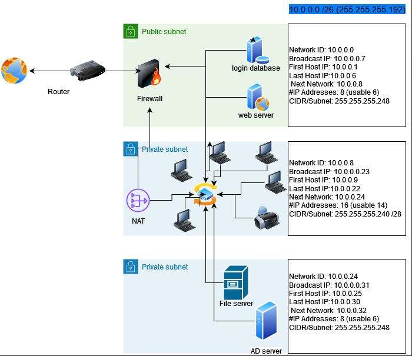

# Network Case Study

Designed a network for a webshop that prioritises Security. 

It contains these devices:

A web server where our webshop is hosted

A database with login credentials for users on the webshop

5 workstations for the office workers

A printer

An AD server

A file server containing internal documents

## Key-terms

       * A web server is software and hardware that uses HTTP (Hypertext Transfer Protocol) and other protocols to respond to client requests made over the World Wide Web.

      * Active Directory stores information about objects on the network and makes this information easy for administrators and users to find and use.

      * File server: A file server is a computer responsible for the storage and management of data files so that other computers on the same network can access the files.

## Opdracht
### Gebruikte bronnen

* __Devices and Usage__ (https://www.youtube.com/watch?v=H7-NR3Q3BeI&ab_channel=PracticalNetworking)

* __Active Directory__ (https://www.techtarget.com/searchwindowsserver/definition/Active-Directory)

* __File Server__ (https://www.techtarget.com/searchnetworking/definition/file-server)

* __Web Server__ (https://www.techtarget.com/whatis/definition/Web-server)

### Resultaat

The architecture has a public server that hosts the webserver and login database that users can access from the internet. Other hosts in the network can access the webserver and login database through a switch to which all other hosts are connected to. The private subnets and public subnet can acces the internet through a firewall and router. The private ones use a NAT router before it goes through the firewall.

* __Network Architecture__

