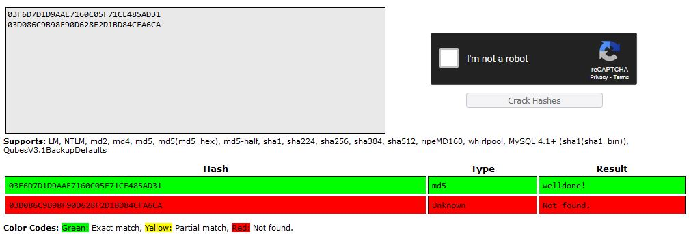
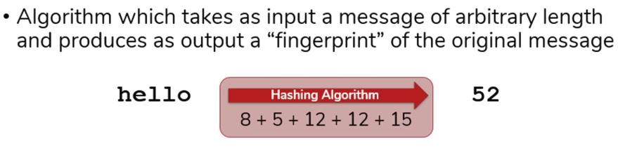
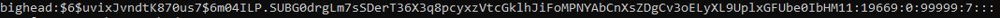
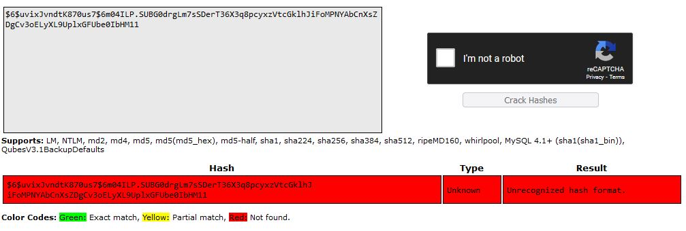

# Passwords
A password is a string of characters used to verify the identity of a user during the authentication process. Passwords are typically used in tandem with a username; they are designed to be known only to the user and allow that user to gain access to a device, application or website. Passwords can vary in length and can contain letters, numbers and special characters.

A password is sometimes called a passphrase, when the password uses more than one word, or a passcode or passkey, when the password uses only numbers, such as a personal identification number (PIN).

A password is a simple application of challenge-response authentication, using a verbal, written or typed code to satisfy the challenge request. The order and variety of characters are often what determines the difficulty, or security strength, of a given password. That is why security systems often require users to create passwords that use at least one capital letter, number and symbol. For a password to be an effective security mechanism, its details must be kept secret. Otherwise, unauthorized users could gain access to the files and securities one is trying to protect.

## Key-terms

Hashing is one way mechanism. you can't decrypt it!

A rainbow table is a precomputed table for caching the outputs of a cryptographic hash function, usually for cracking password hashes. Passwords are typically stored not in plain text form, but as hash values.

Hashing is the practice of transforming a given key or string of characters into another value for the purpose of security.

Synonyms: hash digest, hash value, or hash code.

A hash table uses a hash function to compute an index, also called a hash code, into an array of buckets or slots, from which the desired value can be found.

a hash collision: two messages result in identical digests.

Passphrase is a sentence like string of words, numbers or symbols used for authentication that is longer than a traditional password.

Salting adds random characters to data, like passwords, to thwart hackers who look for consistent words and phrases in sensitive data in order to decode it.

Hashing takes plaintext data elements and converts them into consistent ciphertext outputs used for data verification.

A hash value/code is a numeric value of a fixed length that uniquely identifies data. Hash values represent large amounts of data as much smaller numeric values, so they are used with digital signatures.

Hash function/algorithm: is a method of cryptography to convert data into a string. The size of the input is irrelevant. The hash function will always give an output of the same length. The same input will result in the same output. When two different people enter ''hello'' as input, they will get the same digest as output.

* The general workflow for account registration and authentication in a hash-based account system is as follows:

  * The user creates an account.

  * Their password is hashed and stored in the database. At no point is the plain-text (unencrypted) password ever written to the hard drive.

  * When the user attempts to login, the hash of the password they entered is checked against the hash of their real password (retrieved from the database).

  * If the hashes match, the user is granted access. If not, the user is told they entered invalid login credentials.

  * Steps 3 and 4 repeat every time someone tries to login to their account.
 
Hash Key: Is the data you want to turn into a Hash value.

The hashing algorithm is the algorithm which performs a function to convert the hash key to the hash value. 

The hash value is what is produced as a result of the hash key being passed into the hashing algorithm.

Hash algorithm: The word you want to hash goes through the algorithm. Lets take the word ''hello''. Depending on the algorithm it might use the position of each letter in the alphabet to produce a string. h=8, e=5 etc. It might use adding up all the numbers to generate a Hash Value. So it becomes 8+5+12+12+5 = Hash Value of 52.

Hashing Algorithm must satisfy 4 requirements:
    Infeasible to produce a given digest
    Impossible to extract original message
    Slight changes produce drastic differences
    Resulting digest is fixed width (length)

A word or sentence will always produce the same digest. Changing it slightly will produce a significant different digest. The furter down the word or sentence the edit is made, the biggest the difference in the digest will be.

---
__Find out how a Rainbow Table can be used to crack hashed passwords.__

Rainbow tables are made by running different plaintext words or characters through the hash function.  The output is the hash value, so know you know what hash is matched to a plaintext word or character.  The plaintext is then put in a table next to their matched hash.  A password cracking program can then take the hash you want to crack and compare it to the hashes and plaintexts in the Rainbow Table.

__Find out what hashing is and why it is preferred over symmetric encryption for storing passwords.__

Hashing is a one-way function (i.e., it is impossible to "decrypt" a hash and obtain the original plaintext value). Hashing is appropriate for password validation. Even if an attacker obtains the hashed password, they cannot enter it into an application's password field and log in as the victim.

Encryption is a two-way function, meaning that the original plaintext can be retrieved. Encryption is appropriate for storing data such as a user's address since this data is displayed in plaintext on the user's profile. Hashing their address would result in a garbled mess.

## Opdracht

### Gebruikte bronnen

* __What is a password/passphrase?__ (https://www.techtarget.com/searchsecurity/definition/password)
* __Rainbow Table__ (https://www.techtarget.com/whatis/definition/rainbow-table)
* __Hashing vs Encryption__ (https://cheatsheetseries.owasp.org/cheatsheets/Password_Storage_Cheat_Sheet.html)

### Resultaat

* __Examples: Found/Not Found__

 

* __Algorithm Example__

 

* __New User in VM with HASH__

* __VM Hash is Salted, so Result is: Unrecognized hash format.__

 
