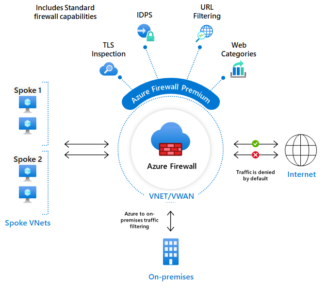

# Firewalls
[Geef een korte beschrijving van het onderwerp]

## Key-terms

Unlike Azure Firewall, which monitors all traffic for workloads, NSG is commonly deployed for individual vNets, subnets, and network interfaces for virtual machines to refine traffic. It does so by activating a rule (allow or deny) or Access Control List (ACL), which allows or denies traffic to Azure resources.

Firewall policy entails the specific instructions that determine which traffic is allowed or blocked based on criteria such as source and destination IP addresses, ports, protocols, and application types. 

A firewall is a computer network security system that restricts internet traffic in to, out of, or within a private network.

This software or dedicated hardware-software unit functions by selectively blocking or allowing data packets. It is typically intended to help prevent malicious activity and to prevent anyone—inside or outside a private network—from engaging in unauthorized web activities.

## Opdracht
### Gebruikte bronnen

* __Azure Firewall__ (https://learn.microsoft.com/en-us/azure/firewall/features)
* __Firewall__ (https://www.kaspersky.com/resource-center/definitions/firewall)
* __Firewall Policy__ (https://www.enterprisenetworkingplanet.com/security/firewall-policy/)
* __Azure Firewall vs Network Security Group & Premium vs Basic__ (https://k21academy.com/microsoft-azure/az-500/azure-firewall-vs-nsg/)

### Resultaat

* __Created VM__

* __SSH Connection Works__

* __SSH Connection Blocked__

* __Server Works__

* __Firewall Basic__

* __Firewall Premium__

