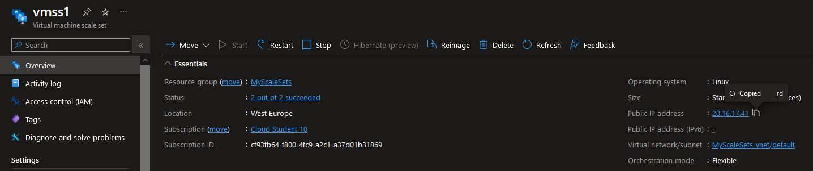
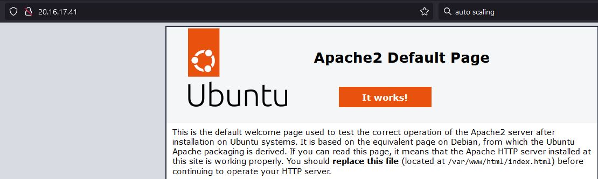
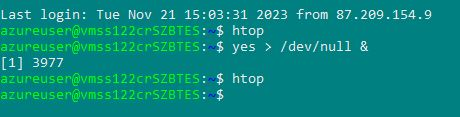
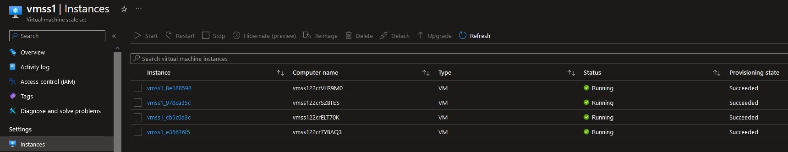
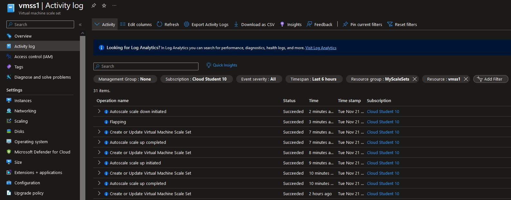

# Auto Load Balance & Autoscale

Azure Virtual Machine Scale Sets let you create and manage a group of load balanced VMs. The number of VM instances can automatically increase or decrease in response to demand or a defined schedule. Scale sets provide the following key benefits:

    Easy to create and manage multiple VMs
    Provides high availability and application resiliency by distributing VMs across availability zones or fault domains
    Allows your application to automatically scale as resource demand changes
    Works at large-scale

---

Autoscale is a service that you can use to automatically add and remove resources according to the load on your application.

When your application experiences higher load, autoscale adds resources to handle the increased load. When load is low, autoscale reduces the number of resources, which lowers your costs. You can scale your application based on metrics like CPU usage, queue length, and available memory. You can also scale based on a schedule. Metrics and schedules are set up in rules. The rules include a minimum level of resources that you need to run your application and a maximum level of resources that won't be exceeded.

For example, scale out your application by adding VMs when the average CPU usage per VM is above 75%. Scale it back by removing VMs when CPU usage drops to 30%.

---

Load balancing refers to efficiently distributing incoming network traffic across a group of backend servers or resources.

Azure Load Balancer operates at layer 4 of the Open Systems Interconnection (OSI) model. It's the single point of contact for clients. Load balancer distributes inbound flows that arrive at the load balancer's front end to backend pool instances. These flows are according to configured load-balancing rules and health probes. The backend pool instances can be Azure Virtual Machines or instances in a Virtual Machine Scale Set.

A public load balancer can provide outbound connections for virtual machines (VMs) inside your virtual network. These connections are accomplished by translating their private IP addresses to public IP addresses. Public Load Balancers are used to load balance internet traffic to your VMs.

An internal (or private) load balancer is used where private IPs are needed at the frontend only. Internal load balancers are used to load balance traffic inside a virtual network. A load balancer frontend can be accessed from an on-premises network in a hybrid scenario.

## Key-terms

sudo stress --cpu 80 --timeout 500

sudo apt install stress = install before performing stress test

sudo apt install stress-ng = more advanced stress tool
 
Load Balancing: Distribution of traffic across multiple resources. You can have to VMs and connect it to a Load Balancer that connects to the internet and distributes inbound and outbound traffic to and from the VMs.

A Load Balancer monitors the Health of each resource its connected to.

Traditional load balancers operate at the transport layer (OSI layer 4 - TCP and UDP) and route traffic based on source IP address and port, to a destination IP address and port. 

Azure Application Gateway is a web traffic (OSI layer 7) load balancer that enables you to manage traffic to your web applications. Traditional load balancers operate at the transport layer (OSI layer 4 - TCP and UDP) and route traffic based on source IP address and port, to a destination IP address and port.

## Opdracht

### Gebruikte bronnen

* __Stress Test__   (https://linuxhint.com/useful_linux_stress_test_benchmark_cpu_perf/)
* __Autoscale__ (https://learn.microsoft.com/en-us/azure/azure-monitor/autoscale/autoscale-overview)
* __Azure Load Balancer__   (https://learn.microsoft.com/en-us/azure/load-balancer/load-balancer-overview)
* __Virtual Machine Set Scale (https://learn.microsoft.com/en-us/azure/virtual-machine-scale-sets/overview)

### Ervaren problemen
Didn't manage to connect to my VM in terminal. I had to redeploy the VM to make it work.

### Resultaat

* __Virtual Machine Set Scale__

* __IP Available in Browser__

* __Command to Increase CPU usage__ (better to use: sudo stress --cpu 80 --timeout 500)

* __Increased to 4 Instances__

* __Shows Scale up And Scale Down__

