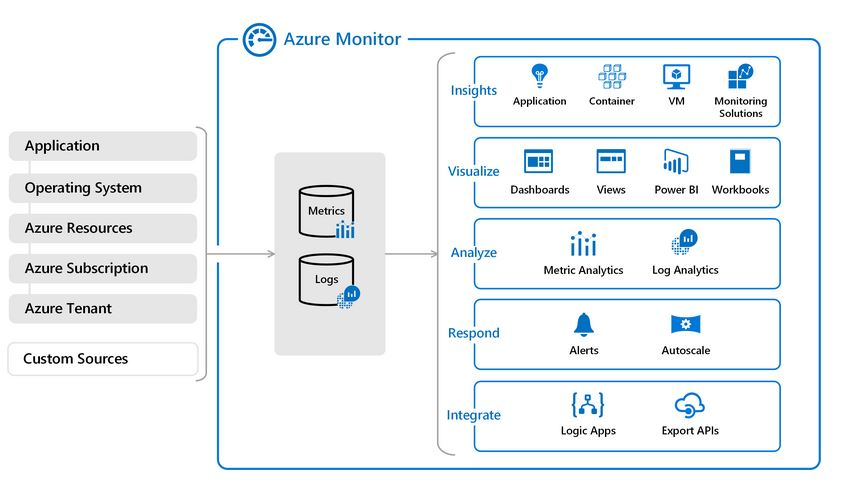

# Azure Monitor

Azure Monitor is a comprehensive monitoring solution provided by Microsoft Azure to help organizations gain insights into the performance, availability, and health of their applications, infrastructure, and networks. It addresses several key challenges in the monitoring and management of cloud-based and on-premises environments. Here are some key aspects related to Azure Monitor:

    Problem Solving:
        Visibility: Azure Monitor provides a unified view of your applications and infrastructure across Azure, on-premises, and other cloud platforms.
        Performance Monitoring: It allows you to monitor the performance and availability of applications and services in real-time.
        Alerting and Notifications: Azure Monitor enables you to set up alerts and notifications based on customizable criteria to proactively respond to issues.

    Key Terms:
        Log Analytics: A feature within Azure Monitor that allows you to collect, analyze, and act on telemetry data from your cloud and on-premises environments.
        Metrics: Quantitative measurements of your resources' performance, such as CPU usage, memory utilization, and network traffic.
        Application Insights: A component of Azure Monitor that helps you monitor and improve the performance and user experience of your live applications.

    Azure Monitor vs. On-Premises:
        In an on-premises setting, Azure Monitor can replace or complement traditional monitoring tools. It provides a unified monitoring solution for both on-premises and cloud environments, enabling organizations to manage hybrid infrastructures seamlessly.

    Combining with Other Services:
        Azure Monitor can be combined with other Azure services for a more comprehensive solution. For example:
            Azure Log Analytics: Collects and analyzes log data from different sources.
            Azure Application Insights: Focuses on application performance and user experience monitoring.
            Azure Security Center: Enhances security monitoring and threat detection.

    Difference from Similar Services:
        Azure Application Insights: Focuses specifically on application performance monitoring and diagnostics.
        Azure Log Analytics: Primarily focuses on log data collection and analysis.
        Azure Security Center: Concentrates on security monitoring, threat detection, and vulnerability management.

Monitor uses to types of data: Metrics and Logs.
        
## Opdracht
### Gebruikte bronnen

* __Azure Monitor__ (https://learn.microsoft.com/en-us/azure/azure-monitor/overview)
* __What is Azure Monitor__ (https://pragmaticworks.com/blog/what-is-azure-monitor)

---

* __Azure Monitor__

