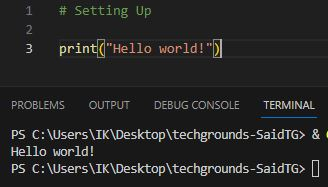

# Setting Up

__Exercise:__

    Install the latest version of Python from https://www.python.org/
    Install VS Code from https://code.visualstudio.com/download
    Install the Python plug-in in VS Code.
    Write the following Python code. The output in the terminal should be the text “Hello world!”

1. Python files are .py
2. Save file before running it

---

        print("Hello world!")

* [Setting Up.py](Python.py/09_1_SettingUp.py)

